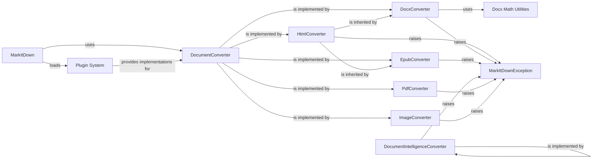

## Details

The Document Conversion Framework is the core of the `markitdown` project, embodying the Strategy and Plugin architectural patterns. It provides a flexible and extensible way to convert various document types into a unified format, likely Markdown, for further processing, especially for LLM data preparation.

### DocumentConverter
This is the cornerstone of the framework, defining the `accepts` and `convert` interface that all concrete document converters must implement. It ensures a consistent contract for different conversion strategies, allowing the `MarkItDown` facade to interact with various document types uniformly. This adheres to the Strategy Pattern, enabling easy addition of new document types without modifying the core logic.

**Related Classes/Methods**:

- <a href="https://github.com/microsoft/markitdown/blob/main/temp/packages/markitdown/src/markitdown/_base_converter.py#L41-L104" target="_blank" rel="noopener noreferrer">`markitdown._base_converter.DocumentConverter` (41:104)</a>

### HtmlConverter
A concrete implementation of `DocumentConverter` for HTML content. Crucially, it also serves as a base class for other converters (like `DocxConverter`, `EpubConverter`, `PptxConverter`, `XlsConverter`, `XlsxConverter`) that involve an intermediate HTML representation during their conversion process. It encapsulates common logic for parsing and processing HTML before final conversion to Markdown.

**Related Classes/Methods**:

- <a href="https://github.com/microsoft/markitdown/blob/main/temp/packages/markitdown/src/markitdown/converters/_html_converter.py#L19-L89" target="_blank" rel="noopener noreferrer">`markitdown.converters._html_converter.HtmlConverter` (19:89)</a>

### DocxConverter
A specific implementation of `DocumentConverter` designed to handle DOCX content. It likely leverages the `HtmlConverter` for intermediate processing and integrates with specialized utilities for handling complex elements like mathematical equations.

**Related Classes/Methods**:

- <a href="https://github.com/microsoft/markitdown/blob/main/temp/packages/markitdown/src/markitdown/converters/_docx_converter.py#L27-L79" target="_blank" rel="noopener noreferrer">`markitdown.converters._docx_converter.DocxConverter` (27:79)</a>

### EpubConverter
A specific implementation of `DocumentConverter` designed to handle EPUB content, inheriting from `HtmlConverter`. This indicates that EPUB conversion likely involves extracting or transforming EPUB content into an HTML representation before further processing.

**Related Classes/Methods**:

- <a href="https://github.com/microsoft/markitdown/blob/main/temp/packages/markitdown/src/markitdown/converters/_epub_converter.py#L25-L145" target="_blank" rel="noopener noreferrer">`markitdown.converters._epub_converter.EpubConverter` (25:145)</a>

### DocumentIntelligenceConverter
A specialized implementation of `DocumentConverter` for processing content from Azure Document Intelligence. This converter is crucial for integrating with external AI-powered document processing services, enabling advanced extraction and understanding of document content.

**Related Classes/Methods**:

- <a href="https://github.com/microsoft/markitdown/blob/main/temp/packages/markitdown/src/markitdown/converters/_doc_intel_converter.py#L124-L248" target="_blank" rel="noopener noreferrer">`markitdown.converters._doc_intel_converter.DocumentIntelligenceConverter` (124:248)</a>

### PdfConverter
A specific implementation of `DocumentConverter` for handling PDF content. PDF is a ubiquitous document format, and this converter is essential for enabling the framework to process a vast array of documents.

**Related Classes/Methods**:

- <a href="https://github.com/microsoft/markitdown/blob/main/temp/packages/markitdown/src/markitdown/converters/_pdf_converter.py#L30-L76" target="_blank" rel="noopener noreferrer">`markitdown.converters._pdf_converter.PdfConverter` (30:76)</a>

### ImageConverter
A specific implementation of `DocumentConverter` for handling image content. This converter likely uses OCR (Optical Character Recognition) to extract text from images, making image-based documents searchable and convertible.

**Related Classes/Methods**:

- <a href="https://github.com/microsoft/markitdown/blob/main/temp/packages/markitdown/src/markitdown/converters/_image_converter.py#L15-L137" target="_blank" rel="noopener noreferrer">`markitdown.converters._image_converter.ImageConverter` (15:137)</a>

### Docx Math Utilities
A specialized utility module within `converter_utils/docx/math` responsible for parsing and converting Office Math Markup Language (OMML) expressions found in DOCX files into LaTeX format. This is a crucial helper for `DocxConverter` to accurately represent mathematical content.

**Related Classes/Methods**:

- <a href="https://github.com/microsoft/markitdown/blob/main/temp/packages/markitdown/src/markitdown/converter_utils/docx/math/omml.py#L1-L1" target="_blank" rel="noopener noreferrer">`markitdown.converter_utils.docx.math.omml` (1:1)</a>

### Plugin System
This represents the extensible architecture for integrating external conversion capabilities. It allows third-party developers to create and register custom `DocumentConverter` implementations, which the `MarkItDown` orchestrator can then discover and utilize, extending the framework's supported document types without modifying the core library.

**Related Classes/Methods**:

- <a href="https://github.com/microsoft/markitdown/blob/main/temp/packages/markitdown-sample-plugin/src/markitdown_sample_plugin/_plugin.py#L1-L1" target="_blank" rel="noopener noreferrer">`markitdown_sample_plugin._plugin` (1:1)</a>
- <a href="https://github.com/microsoft/markitdown/blob/main/temp/packages/markitdown/src/markitdown/_markitdown.py#L92-L770" target="_blank" rel="noopener noreferrer">`markitdown._markitdown.MarkItDown` (92:770)</a>

### MarkItDownException
This is the base class for all custom exceptions raised within the `markitdown` library. It provides a consistent and identifiable error handling mechanism across the entire subsystem, allowing for specific error handling and better debugging.

**Related Classes/Methods**:

- <a href="https://github.com/microsoft/markitdown/blob/main/temp/packages/markitdown/src/markitdown/_exceptions.py#L10-L15" target="_blank" rel="noopener noreferrer">`markitdown._exceptions.MarkItDownException` (10:15)</a>

### MarkItDown
The orchestrator/facade of the Document Conversion Framework, responsible for dispatching conversion requests and loading plugins.

**Related Classes/Methods**:

- <a href="https://github.com/microsoft/markitdown/blob/main/temp/packages/markitdown/src/markitdown/_markitdown.py#L92-L770" target="_blank" rel="noopener noreferrer">`markitdown._markitdown.MarkItDown` (92:770)</a>

### [FAQ](https://github.com/CodeBoarding/GeneratedOnBoardings/tree/main?tab=readme-ov-file#faq)