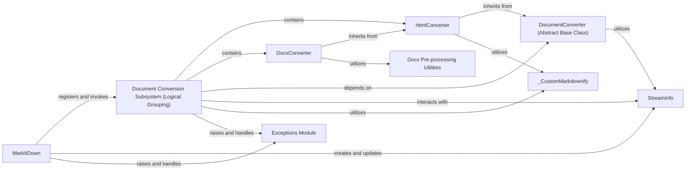

## Component Details

The `Document Conversion Subsystem` is the heart of MarkItDown's ability to process diverse document formats. It's designed with a modular and extensible architecture, centered around a common interface for all converters. This subsystem ensures that various input types, from standard documents to web content, can be reliably transformed into a unified Markdown format for further processing, particularly by Language Models.

### MarkItDown
The primary orchestrator of the `markitdown` library. It manages the registration and invocation of various document converters. It provides methods to convert content from local paths, URIs (file, data, http/https), and raw binary streams. It also handles the initial identification of stream information (like mimetype and charset) using external libraries. It serves as the main entry point for conversion requests.

**Related Classes/Methods**:

- <a href="https://github.com/microsoft/markitdown/blob/master/packages/markitdown/src/markitdown/_markitdown.py#L1-L1" target="_blank" rel="noopener noreferrer">`markitdown._markitdown` (1:1)</a>

### DocumentConverter (Abstract Base Class)
This is an abstract base class (or interface) that defines the contract for all specific document converters. Each concrete implementation must implement the `accepts` method (to indicate if it can handle a given `StreamInfo`) and the `convert` method (to perform the actual conversion to Markdown). It ensures a consistent and extensible interface for all converters within the `Document Conversion Subsystem`.

**Related Classes/Methods**:

- <a href="https://github.com/microsoft/markitdown/blob/master/packages/markitdown/src/markitdown/_base_converter.py#L41-L104" target="_blank" rel="noopener noreferrer">`markitdown._base_converter.DocumentConverter` (41:104)</a>

### Document Conversion Subsystem (Logical Grouping)
This is the overarching package (`markitdown.converters`) that houses all specialized `DocumentConverter` implementations. It serves as the central repository for the diverse conversion logic, enabling MarkItDown to support a wide array of input formats. Its modular design allows for easy addition of new converters.

**Related Classes/Methods**:

- `markitdown.converters` (1:1)

### StreamInfo
A data class used to encapsulate metadata about the input stream being processed, such as its mimetype, file extension, filename, local path, URL, and character set. It is crucial for converters to determine if they can handle a given input and for providing necessary context during the conversion process.

**Related Classes/Methods**:

- <a href="https://github.com/microsoft/markitdown/blob/master/packages/markitdown/src/markitdown/_stream_info.py#L5-L31" target="_blank" rel="noopener noreferrer">`markitdown._stream_info.StreamInfo` (5:31)</a>

### HtmlConverter
A concrete implementation of `DocumentConverter` specifically designed to convert HTML content into Markdown. It leverages `_CustomMarkdownify` for the actual conversion and handles pre-processing steps like removing script and style tags.

**Related Classes/Methods**:

- <a href="https://github.com/microsoft/markitdown/blob/master/packages/markitdown/src/markitdown/converters/_html_converter.py#L19-L89" target="_blank" rel="noopener noreferrer">`markitdown.converters._html_converter.HtmlConverter` (19:89)</a>

### DocxConverter
A concrete implementation of `DocumentConverter` for DOCX files. It extends `HtmlConverter` and utilizes external libraries (like `mammoth`) and internal utilities (`pre_process_docx`) to convert DOCX content into HTML, which is then further converted to Markdown by its parent `HtmlConverter`.

**Related Classes/Methods**:

- <a href="https://github.com/microsoft/markitdown/blob/master/packages/markitdown/src/markitdown/converters/_docx_converter.py#L27-L79" target="_blank" rel="noopener noreferrer">`markitdown.converters._docx_converter.DocxConverter` (27:79)</a>

### _CustomMarkdownify
A specialized Markdown converter, built upon or extending an existing `markdownify` library. It is specifically used by several HTML-based converters within the `Document Conversion Subsystem` (e.g., `HtmlConverter`, `BingSerpConverter`, `WikipediaConverter`, `RssConverter`) to efficiently and consistently convert HTML content into Markdown, with custom handling for headings, links, and images.

**Related Classes/Methods**:

- <a href="https://github.com/microsoft/markitdown/blob/master/packages/markitdown/src/markitdown/converters/_markdownify.py#L7-L110" target="_blank" rel="noopener noreferrer">`markitdown.converters._markdownify._CustomMarkdownify` (7:110)</a>

### Docx Pre-processing Utilities
This module (`markitdown.converter_utils.docx.pre_process`) contains utility functions specifically designed to pre-process DOCX files before their conversion to HTML. This includes handling complex elements like mathematical equations (OMML to LaTeX conversion).

**Related Classes/Methods**:

- <a href="https://github.com/microsoft/markitdown/blob/master/packages/markitdown/src/markitdown/converter_utils/docx/pre_process.py#L1-L1" target="_blank" rel="noopener noreferrer">`markitdown.converter_utils.docx.pre_process` (1:1)</a>

### Exceptions Module
This module defines custom exception classes (e.g., `FileConversionException`, `UnsupportedFormatException`, `MissingDependencyException`) that are used throughout the `markitdown` library. These exceptions provide specific error handling and feedback mechanisms, crucial for robust operation during the conversion process.

**Related Classes/Methods**:

- <a href="https://github.com/microsoft/markitdown/blob/master/packages/markitdown/src/markitdown/_exceptions.py#L1-L1" target="_blank" rel="noopener noreferrer">`markitdown._exceptions` (1:1)</a>

### [FAQ](https://github.com/CodeBoarding/GeneratedOnBoardings/tree/main?tab=readme-ov-file#faq)