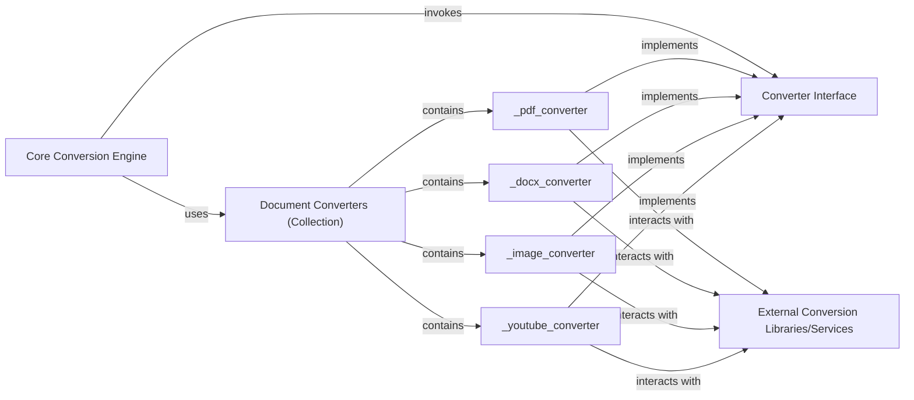

## Details

The `Document Converters` subsystem is a critical part of the `markitdown` project, embodying the Strategy and Plugin architectural patterns. It is responsible for transforming various document formats and data sources into Markdown.

### Document Converters (Collection)
This component represents the overarching collection and management system for all concrete document conversion strategies (plugins). It acts as a central registry, allowing the `Core Conversion Engine` to discover and select the appropriate converter based on the input type. Its existence is crucial for the "Plugin-based System" and "Strategy Pattern," providing a unified and extensible mechanism for handling diverse conversion needs.

**Related Classes/Methods**:

- <a href="https://github.com/microsoft/markitdown/blob/main/packages/markitdown/src/markitdown/converters/" target="_blank" rel="noopener noreferrer">`markitdown.converters` (1:1)</a>

### Converter Interface [[Expand]](./Converter_Interface.md)
This abstract component defines the common contract (methods like `accepts()` and `convert()`) that all concrete document converters must implement. It is fundamental to the "Strategy Pattern" and "Microkernel/Plugin Architecture," ensuring that new converters can be easily integrated and interchanged without altering the core conversion logic.

**Related Classes/Methods**:

- `markitdown.converters.ConverterInterface` (1:1)

### _pdf_converter
A concrete implementation of the `Converter Interface` specifically designed to parse and convert PDF documents into Markdown format. It encapsulates the format-specific logic and dependencies required for PDF processing, adhering to the "Strategy Pattern" by providing a specific conversion strategy.

**Related Classes/Methods**:

- <a href="https://github.com/microsoft/markitdown/blob/main/packages/markitdown/src/markitdown/converters/_pdf_converter.py" target="_blank" rel="noopener noreferrer">`markitdown.converters._pdf_converter` (1:1)</a>

### _docx_converter
A concrete implementation of the `Converter Interface` responsible for parsing DOCX documents and transforming them into Markdown. Similar to the PDF converter, it manages the specific dependencies and logic for DOCX file handling, acting as another distinct conversion strategy.

**Related Classes/Methods**:

- <a href="https://github.com/microsoft/markitdown/blob/main/packages/markitdown/src/markitdown/converters/_docx_converter.py" target="_blank" rel="noopener noreferrer">`markitdown.converters._docx_converter` (1:1)</a>

### _image_converter
A concrete implementation of the `Converter Interface` that processes image files. Its unique responsibility includes interacting with an external LLM service (e.g., OpenAI) to generate descriptive text for images, which is then embedded into the Markdown output. This highlights the extensibility of the plugin architecture to incorporate external AI services.

**Related Classes/Methods**:

- <a href="https://github.com/microsoft/markitdown/blob/main/packages/markitdown/src/markitdown/converters/_image_converter.py" target="_blank" rel="noopener noreferrer">`markitdown.converters._image_converter` (1:1)</a>

### _youtube_converter
A concrete implementation of the `Converter Interface` focused on fetching and converting content from YouTube. It includes mechanisms for interacting with external YouTube APIs and robust retry logic for reliable data retrieval, showcasing the ability to integrate with diverse online data sources.

**Related Classes/Methods**:

- <a href="https://github.com/microsoft/markitdown/blob/main/packages/markitdown/src/markitdown/converters/_youtube_converter.py" target="_blank" rel="noopener noreferrer">`markitdown.converters._youtube_converter` (1:1)</a>

### Core Conversion Engine [[Expand]](./Core_Conversion_Engine.md)
This component, represented by the `MarkItDown` class, acts as the central orchestrator and consumer of the `Document Converters` subsystem. It queries the `Document Converters (Collection)` to find the appropriate converter using the `Converter Interface`'s `accepts()` method and then invokes its `convert()` method. This component embodies the "Facade" and "Microkernel" patterns, coordinating the overall conversion process without needing to know the specifics of each conversion strategy.

**Related Classes/Methods**:

- `markitdown.markitdown.MarkItDown` (1:1)

### External Conversion Libraries/Services
This component represents the various external dependencies (e.g., PDF parsing libraries, DOCX parsing libraries, LLM services like OpenAI, YouTube APIs) that individual concrete converters interact with to perform their specialized conversion tasks. While external to the `markitdown` project's core, they are critical for the functionality of the `Document Converters` subsystem, enabling the actual data transformation.

**Related Classes/Methods**:

- `External` (1:1)

### [FAQ](https://github.com/CodeBoarding/GeneratedOnBoardings/tree/main?tab=readme-ov-file#faq)