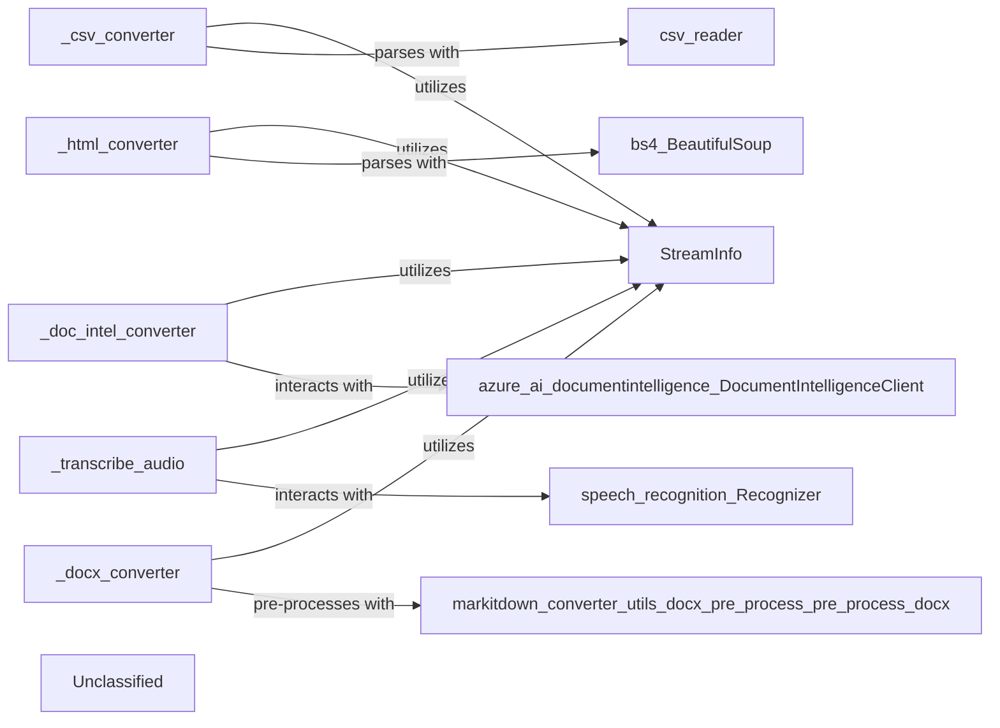

## Details

The `markitdown` conversion subsystem is designed around a set of specialized converters, each responsible for transforming a specific document or media type into Markdown. Each converter, such as `_csv_converter`, `_html_converter`, `_doc_intel_converter`, `_transcribe_audio`, and `_docx_converter`, leverages the `StreamInfo` component to access and interpret input stream metadata. For core parsing, `_csv_converter` directly uses `csv.reader`, while `_html_converter` employs `BeautifulSoup`. More complex conversions involve external services or dedicated pre-processors: `_doc_intel_converter` integrates with `azure.ai.documentintelligence.DocumentIntelligenceClient` for advanced document processing, `_transcribe_audio` utilizes `speech_recognition.Recognizer` for audio transcription, and `_docx_converter` relies on `markitdown.converter_utils.docx.pre_process.pre_process_docx` for handling DOCX-specific elements like mathematical equations. This modular design ensures efficient and accurate conversion across diverse input formats.

### _csv_converter
Parses CSV content and transforms it into a standardized Markdown representation.

**Related Classes/Methods**:

### _html_converter
Handles the parsing of HTML content and its conversion to Markdown.

**Related Classes/Methods**:

- `bs4.BeautifulSoup`:1-10

### _doc_intel_converter
Integrates with external document intelligence services (e.g., Azure Document Intelligence) to process complex document formats (like PDFs) and convert their content to Markdown.

**Related Classes/Methods**:

### _transcribe_audio
Utilizes external AI/ML services for transcribing audio input into text, which is then formatted as Markdown.

**Related Classes/Methods**:

### _docx_converter
Converts DOCX content into Markdown, including handling complex elements like mathematical equations.

**Related Classes/Methods**:

- <a href="https://github.com/microsoft/markitdown/blob/main/packages/markitdown/src/markitdown/converter_utils/docx/pre_process.py#L118-L156" target="_blank" rel="noopener noreferrer">`markitdown.converter_utils.docx.pre_process.pre_process_docx`:118-156</a>

### StreamInfo
Provides a unified interface for accessing and interpreting metadata and content from diverse input streams, enabling efficient processing by various converters.

**Related Classes/Methods**:

- <a href="https://github.com/microsoft/markitdown/blob/main/packages/markitdown/src/markitdown/_stream_info.py#L5-L32" target="_blank" rel="noopener noreferrer">`markitdown._stream_info.StreamInfo`:5-32</a>

### Unclassified
Component for all unclassified files and utility functions (Utility functions/External Libraries/Dependencies)

**Related Classes/Methods**: _None_

### [FAQ](https://github.com/CodeBoarding/GeneratedOnBoardings/tree/main?tab=readme-ov-file#faq)