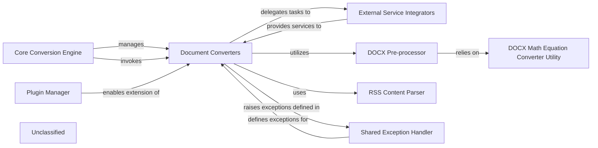

## Details

The system is designed around a Core Conversion Engine that orchestrates the conversion of various document types into a standardized Markdown format. It manages and invokes a set of Document Converters, each specialized for a particular input format. The system's extensibility is facilitated by a Plugin Manager, allowing for dynamic integration of new converters. Document Converters can delegate complex tasks to External Service Integrators for external API interactions and utilize specialized pre-processors like the DOCX Pre-processor (which in turn relies on the DOCX Math Equation Converter Utility) and the RSS Content Parser for specific content handling. A Shared Exception Handler ensures consistent error management across all components.

### Core Conversion Engine [[Expand]](./Core_Conversion_Engine.md)
The central orchestrator that manages and invokes the appropriate Document Converters based on the input document type. It provides a facade for simplified interaction with the conversion process.

**Related Classes/Methods**: _None_

### Document Converters [[Expand]](./Document_Converters.md)
The core set of adapters, each responsible for converting a specific document format (e.g., HTML, PDF, DOCX, YouTube) into a standardized Markdown output. They encapsulate format-specific parsing and transformation logic.

**Related Classes/Methods**: _None_

### Plugin Manager
Manages the discovery, loading, and registration of external converter plugins, enabling the dynamic extension of Document Converters with support for new document types.

**Related Classes/Methods**: _None_

### External Service Integrators
Components responsible for handling interactions with external APIs (e.g., Azure Document Intelligence, OpenAI's GPT-4o, YouTube Data API) to enrich or facilitate specific conversion tasks.

**Related Classes/Methods**: _None_

### DOCX Pre-processor
A specialized component for initial processing of DOCX documents, including the conversion of OMML (Office Math Markup Language) equations to LaTeX format.

**Related Classes/Methods**: _None_

### RSS Content Parser
A utility specifically designed for parsing and converting HTML content embedded within RSS or Atom feeds into a format suitable for Markdown conversion.

**Related Classes/Methods**: _None_

### Shared Exception Handler
Provides a consistent mechanism for defining, raising, and managing exceptions across the library, ensuring uniform error reporting from all converters and related components.

**Related Classes/Methods**: _None_

### DOCX Math Equation Converter Utility
A utility used by the DOCX Pre-processor to convert OMML math equations found in DOCX documents into LaTeX format.

**Related Classes/Methods**: _None_

### Unclassified
Component for all unclassified files and utility functions (Utility functions/External Libraries/Dependencies)

**Related Classes/Methods**: _None_

### [FAQ](https://github.com/CodeBoarding/GeneratedOnBoardings/tree/main?tab=readme-ov-file#faq)