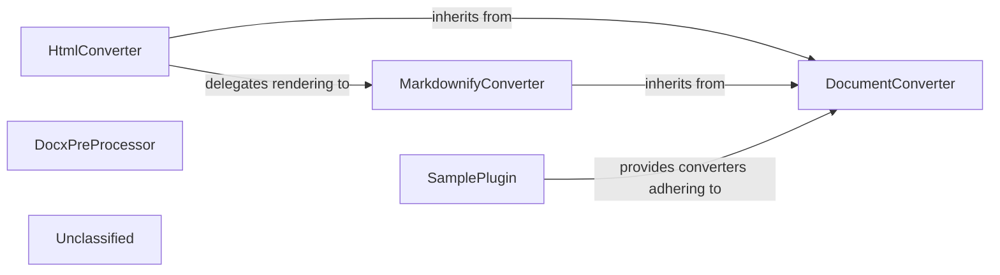

## Details

The `markitdown` project is designed around a flexible document conversion architecture, primarily centered on the `DocumentConverter` abstract base class. This class establishes a common interface for all converters, ensuring consistency in how different document types are processed. Concrete implementations like `HtmlConverter` specialize in handling specific formats, such as HTML, by parsing and transforming content into Markdown. The `MarkdownifyConverter` acts as a utility, providing a standardized mechanism for HTML-to-Markdown conversion, often leveraged by other converters. For specialized pre-processing, such as handling mathematical expressions in DOCX documents, the `DocxPreProcessor` component is utilized, demonstrating a pipeline approach to conversion. The system also supports extensibility through a Plugin/Extension Architecture, exemplified by `SamplePlugin`, which allows external modules to integrate their own custom converters, thereby expanding the range of supported document types and conversion logic. This design promotes modularity, reusability, and extensibility, making it adaptable to various document conversion needs.

### DocumentConverter
An abstract base class that defines the common interface and contract for all concrete document converters. It establishes methods like `accepts` (to determine if a converter can handle a given input) and `convert` (to perform the actual conversion). This component is architecturally central as it enforces a consistent API for all conversion logic, enabling the Plugin/Extension Architecture.

**Related Classes/Methods**:

- <a href="https://github.com/microsoft/markitdown/blob/mainpackages/markitdown/src/markitdown/_base_converter.py#L42-L105" target="_blank" rel="noopener noreferrer">`markitdown._base_converter.DocumentConverter`:42-105</a>

### HtmlConverter
A concrete implementation of `DocumentConverter` specifically designed for processing HTML content. Its responsibilities include parsing HTML, removing extraneous elements (e.g., scripts, styles), and transforming the main content into Markdown. It represents a specialized parser within the conversion pipeline.

**Related Classes/Methods**:

- <a href="https://github.com/microsoft/markitdown/blob/mainpackages/markitdown/src/markitdown/converters/_html_converter.py#L20-L89" target="_blank" rel="noopener noreferrer">`markitdown.converters._html_converter.HtmlConverter`:20-89</a>

### MarkdownifyConverter
A general-purpose converter that leverages the `markdownify` library to convert HTML-like input into Markdown. It serves as a reusable utility for HTML-to-Markdown transformation, often delegated to by other converters. Its importance lies in providing a standardized HTML rendering mechanism.

**Related Classes/Methods**:

- <a href="https://github.com/microsoft/markitdown/blob/mainpackages/markitdown/src/markitdown/converters/_markdownify.py" target="_blank" rel="noopener noreferrer">`markitdown.converters._markdownify.MarkdownifyConverter`</a>

### DocxPreProcessor
A utility component focused on pre-processing specific elements within DOCX documents, particularly mathematical expressions, to prepare them for subsequent Markdown conversion. This component is crucial for handling format-specific complexities before general conversion, aligning with the Pipeline/Chain of Responsibility pattern.

**Related Classes/Methods**:

- <a href="https://github.com/microsoft/markitdown/blob/mainpackages/markitdown/src/markitdown/converter_utils/docx/pre_process.py" target="_blank" rel="noopener noreferrer">`markitdown.converter_utils.docx.pre_process.DocxPreProcessor`</a>

### SamplePlugin
Represents an example of how external plugins can extend the `markitdown` system by providing their own specialized converters. This component is vital for demonstrating and enabling the project's Plugin/Extension Architecture, showcasing how new document types or conversion logic can be integrated.

**Related Classes/Methods**:

- <a href="https://github.com/microsoft/markitdown/blob/mainpackages/markitdown-sample-plugin/src/markitdown_sample_plugin/_plugin.py" target="_blank" rel="noopener noreferrer">`markitdown_sample_plugin._plugin.SamplePlugin`</a>

### Unclassified
Component for all unclassified files and utility functions (Utility functions/External Libraries/Dependencies)

**Related Classes/Methods**: _None_

### [FAQ](https://github.com/CodeBoarding/GeneratedOnBoardings/tree/main?tab=readme-ov-file#faq)