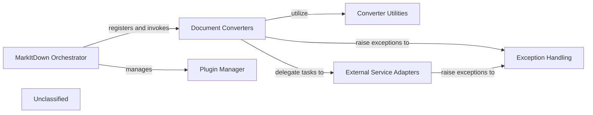

## Details

The MarkItDown subsystem provides a robust and extensible framework for converting diverse document formats into Markdown. At its core, the `MarkItDown Orchestrator` intelligently identifies document types and orchestrates the conversion process by selecting and invoking specialized `Document Converters`. These converters leverage `Converter Utilities` for common processing tasks and integrate with `External Service Adapters` to offload complex operations to external platforms like Azure Document Intelligence. The system's flexibility is further enhanced by a `Plugin Manager` mechanism, allowing for the dynamic addition of new conversion capabilities. A dedicated `Exception Handling` component ensures consistent and informative error reporting across the subsystem, making it resilient to various operational challenges.

### Document Converters [[Expand]](./Document_Converters.md)
This component represents the collection of specialized modules, each responsible for parsing a specific document format (e.g., DOCX, XLSX, EPUB, PDF, HTML, Images, YouTube, RSS, Outlook MSG, Azure Document Intelligence output) and converting its content into Markdown. They encapsulate the format-specific parsing and transformation logic.

**Related Classes/Methods**:

- <a href="https://github.com/microsoft/markitdown/blob/main/packages/markitdown/src/markitdown/converters/_docx_converter.py#L38-L90" target="_blank" rel="noopener noreferrer">`markitdown.converters._docx_converter.DocxConverter`:38-90</a>

### MarkItDown Orchestrator
Acts as the central facade for the conversion process. It is responsible for identifying the input document's format, selecting the appropriate `Document Converter`, and orchestrating the conversion workflow. It registers and manages the available converters.

**Related Classes/Methods**:

- <a href="https://github.com/microsoft/markitdown/blob/main/packages/markitdown/src/markitdown/_markitdown.py#L93-L776" target="_blank" rel="noopener noreferrer">`markitdown._markitdown.MarkItDown`:93-776</a>

### Converter Utilities
Provides a set of shared utility functions and helper modules that are leveraged by various `Document Converters`. This includes common pre-processing steps, text manipulation, or other format-agnostic functionalities, promoting code reuse and consistency.

**Related Classes/Methods**:

- <a href="https://github.com/microsoft/markitdown/blob/main/packages/markitdown/src/markitdown/converter_utils/docx/pre_process.py#L118-L156" target="_blank" rel="noopener noreferrer">`markitdown.converter_utils.docx.pre_process.pre_process_docx`:118-156</a>

### External Service Adapters
This component group manages interactions with external services, such as Azure Document Intelligence or AI/LLM platforms. It provides a standardized interface for `Document Converters` to delegate complex or AI-driven tasks (e.g., OCR, image description generation) without needing to know the specifics of the external API.

**Related Classes/Methods**:

- <a href="https://github.com/microsoft/markitdown/blob/main/packages/markitdown/src/markitdown/converters/_doc_intel_converter.py#L130-L254" target="_blank" rel="noopener noreferrer">`markitdown.converters._doc_intel_converter.DocumentIntelligenceConverter`:130-254</a>

### Plugin Manager
Facilitates the dynamic extension of the `Document Converters` subsystem. It allows external plugins or custom converters to be registered and integrated into the `MarkItDown Orchestrator`, enabling new document formats or conversion logic to be added without modifying the core system.

**Related Classes/Methods**:

### Exception Handling
This component is responsible for defining and managing custom exceptions (e.g., `MissingDependencyException`) that can be raised by `Document Converters` or other parts of the subsystem. It provides a consistent mechanism for communicating operational issues, missing requirements, or conversion failures.

**Related Classes/Methods**:

- <a href="https://github.com/microsoft/markitdown/blob/main/packages/markitdown/src/markitdown/_exceptions.py#L19-L31" target="_blank" rel="noopener noreferrer">`markitdown._exceptions.MissingDependencyException`:19-31</a>

### Unclassified
Component for all unclassified files and utility functions (Utility functions/External Libraries/Dependencies)

**Related Classes/Methods**: _None_

### [FAQ](https://github.com/CodeBoarding/GeneratedOnBoardings/tree/main?tab=readme-ov-file#faq)