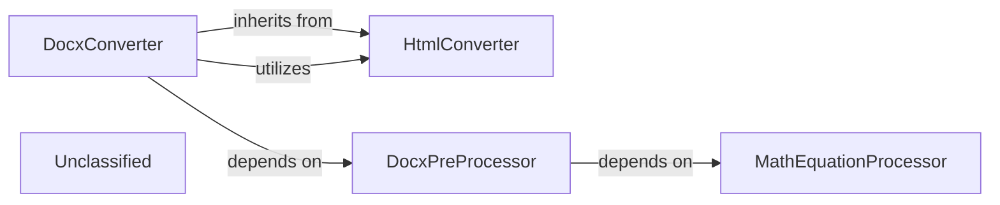

## Details

This subsystem encompasses all modules and utilities responsible for converting various document formats into a standardized Markdown output, including format-specific pre-processing steps. Its primary role is to act as an adapter layer, abstracting the complexities of different document types.

### DocxConverter
The concrete adapter responsible for converting DOCX files into a standardized Markdown output. It orchestrates the format-specific pre-processing and leverages an underlying HTML conversion mechanism.

**Related Classes/Methods**:

- <a href="https://github.com/microsoft/markitdown/blob/main/packages/markitdown/src/markitdown/converters/_docx_converter.py#L38-L90" target="_blank" rel="noopener noreferrer">`DocxConverter`:38-90</a>

### HtmlConverter
A foundational converter that transforms HTML content into Markdown. It serves as an intermediate step for DocxConverter and likely other document converters that first convert their input to HTML.

**Related Classes/Methods**:

- <a href="https://github.com/microsoft/markitdown/blob/main/packages/markitdown/src/markitdown/converters/_html_converter.py#L20-L89" target="_blank" rel="noopener noreferrer">`HtmlConverter`:20-89</a>

### DocxPreProcessor
A utility component that performs format-specific pre-processing on DOCX files. This involves unzipping the DOCX, transforming internal XML files (e.g., for mathematical equations), and re-zipping the content.

**Related Classes/Methods**:

- <a href="https://github.com/microsoft/markitdown/blob/main/packages/markitdown/src/markitdown/converter_utils/docx/pre_process.py#L118-L156" target="_blank" rel="noopener noreferrer">`pre_process_docx`:118-156</a>

### MathEquationProcessor
A specialized utility component responsible for converting Office Math Markup Language (OMML) equations found within DOCX XML into LaTeX format.

**Related Classes/Methods**:

- <a href="https://github.com/microsoft/markitdown/blob/main/packages/markitdown/src/markitdown/converter_utils/docx/pre_process.py#L99-L115" target="_blank" rel="noopener noreferrer">`_pre_process_math`:99-115</a>

### Unclassified
Component for all unclassified files and utility functions (Utility functions/External Libraries/Dependencies)

**Related Classes/Methods**: _None_

### [FAQ](https://github.com/CodeBoarding/GeneratedOnBoardings/tree/main?tab=readme-ov-file#faq)