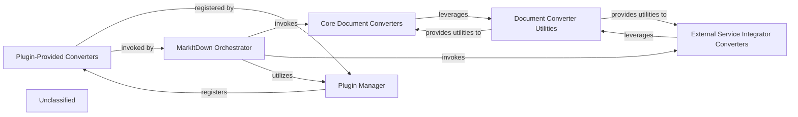

## Details

The `markitdown` system is orchestrated by the `MarkItDown Orchestrator`, which serves as the central hub for document conversion. It dynamically selects and invokes specialized converters based on the input document's format. These converters are categorized into `Core Document Converters` for standard formats and `External Service Integrator Converters` for formats requiring external API interactions. Both types of converters can leverage shared functionalities provided by `Document Converter Utilities`. The system's extensibility is managed by the `Plugin Manager`, which discovers and registers `Plugin-Provided Converters`, making them available to the `MarkItDown Orchestrator` to handle additional document types. This architecture ensures a modular and extensible approach to document conversion, allowing for easy integration of new formats and external services.

### Core Document Converters
A collection of specialized modules responsible for transforming various standard document formats (e.g., CSV, HTML, PPTX, EPUB, YouTube, RSS, Outlook MSG, Jupyter Notebooks) directly into Markdown. These converters encapsulate format-specific parsing and conversion logic without relying on external AI/ML services for the primary conversion.

**Related Classes/Methods**:

- <a href="https://github.com/microsoft/markitdown/blob/main/packages/markitdown/src/markitdown/converters/_csv_converter.py#L15-L77" target="_blank" rel="noopener noreferrer">`markitdown.converters._csv_converter.CsvConverter`:15-77</a>
- <a href="https://github.com/microsoft/markitdown/blob/main/packages/markitdown/src/markitdown/converters/_html_converter.py#L20-L90" target="_blank" rel="noopener noreferrer">`markitdown.converters._html_converter.HtmlConverter`:20-90</a>
- <a href="https://github.com/microsoft/markitdown/blob/main/packages/markitdown/src/markitdown/converters/_pptx_converter.py#L34-L264" target="_blank" rel="noopener noreferrer">`markitdown.converters._pptx_converter.PptxConverter`:34-264</a>
- <a href="https://github.com/microsoft/markitdown/blob/main/packages/markitdown/src/markitdown/converters/_zip_converter.py#L22-L116" target="_blank" rel="noopener noreferrer">`markitdown.converters._zip_converter.ZipConverter`:22-116</a>
- <a href="https://github.com/microsoft/markitdown/blob/main/packages/markitdown/src/markitdown/converters/_epub_converter.py#L26-L146" target="_blank" rel="noopener noreferrer">`markitdown.converters._epub_converter.EpubConverter`:26-146</a>
- <a href="https://github.com/microsoft/markitdown/blob/main/packages/markitdown/src/markitdown/converters/_youtube_converter.py#L37-L238" target="_blank" rel="noopener noreferrer">`markitdown.converters._youtube_converter.YouTubeConverter`:37-238</a>
- <a href="https://github.com/microsoft/markitdown/blob/main/packages/markitdown/src/markitdown/converters/_rss_converter.py#L29-L192" target="_blank" rel="noopener noreferrer">`markitdown.converters._rss_converter.RssConverter`:29-192</a>
- <a href="https://github.com/microsoft/markitdown/blob/main/packages/markitdown/src/markitdown/converters/_outlook_msg_converter.py#L24-L149" target="_blank" rel="noopener noreferrer">`markitdown.converters._outlook_msg_converter.OutlookMsgConverter`:24-149</a>
- <a href="https://github.com/microsoft/markitdown/blob/main/packages/markitdown/src/markitdown/converters/_ipynb_converter.py#L15-L96" target="_blank" rel="noopener noreferrer">`markitdown.converters._ipynb_converter.IpynbConverter`:15-96</a>

### External Service Integrator Converters
Specialized converters within the `markitdown.converters` package that leverage external APIs and services (e.g., Azure Document Intelligence, LLMs) to perform complex document processing or content extraction for formats like PDF, DOCX, XLSX, Images, and Audio. They act as adapters to these external services, translating their output into Markdown.

**Related Classes/Methods**:

- `markitdown.converters._doc_intel_converter.DocIntelConverter`
- <a href="https://github.com/microsoft/markitdown/blob/main/packages/markitdown/src/markitdown/converters/_image_converter.py#L16-L138" target="_blank" rel="noopener noreferrer">`markitdown.converters._image_converter.ImageConverter`:16-138</a>

### Plugin-Provided Converters
Converters supplied by external plugins, extending the `markitdown` system's capabilities beyond its built-in formats. These converters adhere to the plugin interface and are dynamically loaded and registered by the `Plugin Manager`.

**Related Classes/Methods**:

- `markitdown_sample_plugin._plugin.SamplePluginConverter`

### Document Converter Utilities
Provides shared helper functions and common logic that `Core Document Converters` and `External Service Integrator Converters` might leverage to simplify their implementation, promoting code reuse and consistency across different conversion modules.

**Related Classes/Methods**:

### Plugin Manager
Responsible for discovering, loading, and managing external plugins, including `Plugin-Provided Converters`. It ensures that plugins adhere to the defined interface and makes them available to the `MarkItDown Orchestrator`.

**Related Classes/Methods**:

- `markitdown._plugin_manager.PluginManager`

### MarkItDown Orchestrator
The central component of the `markitdown` system, responsible for coordinating the document conversion process. It selects the appropriate converter based on the input document's type, invokes the conversion, and integrates outputs from various converters, including those provided by plugins.

**Related Classes/Methods**:

- <a href="https://github.com/microsoft/markitdown/blob/main/packages/markitdown/src/markitdown/_markitdown.py#L93-L776" target="_blank" rel="noopener noreferrer">`markitdown._markitdown.MarkItDown`:93-776</a>

### Unclassified
Component for all unclassified files and utility functions (Utility functions/External Libraries/Dependencies)

**Related Classes/Methods**: _None_

### [FAQ](https://github.com/CodeBoarding/GeneratedOnBoardings/tree/main?tab=readme-ov-file#faq)