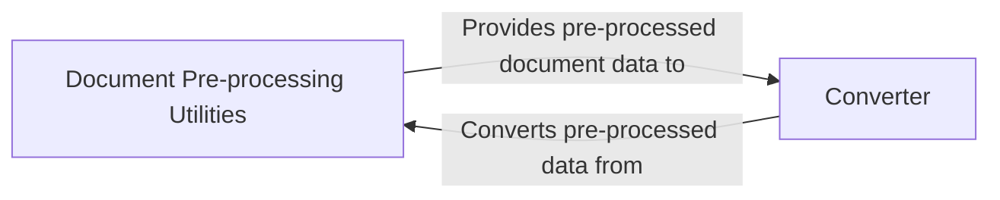

## Details

The `markitdown` project is designed to convert documents, particularly DOCX files, into other formats. The core flow involves a `Document Pre-processing Utilities` component that prepares the input document, followed by a `Converter` component that transforms the pre-processed data into the desired output format. This architecture follows a 'Pipes and Filters' pattern, where the pre-processing acts as a filter, ensuring the document is in an optimal state before the main conversion process.

### Document Pre-processing Utilities [[Expand]](./Document_Pre_processing_Utilities.md)
The `Document Pre-processing Utilities` component is responsible for preparing DOCX documents before they are converted. This involves tasks such as parsing and converting mathematical equations and general document structure preparation. It acts as a crucial filter in the document conversion pipeline, enhancing maintainability and extensibility.

**Related Classes/Methods**:

### Converter
The `Converter` component is responsible for taking the pre-processed document data and transforming it into the final desired output format. This component receives the cleaned and structured data from the `Document Pre-processing Utilities` and applies the necessary conversion logic.

**Related Classes/Methods**:

### [FAQ](https://github.com/CodeBoarding/GeneratedOnBoardings/tree/main?tab=readme-ov-file#faq)