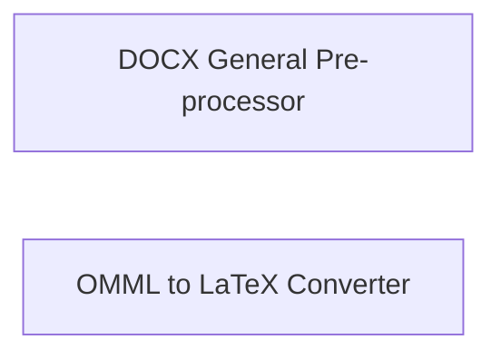

## Details

One paragraph explaining the functionality which is represented by this graph. What the main flow is and what is its purpose.

### DOCX General Pre-processor
Pre-processes DOCX files for conversion.

**Related Classes/Methods**:

- <a href="https://github.com/microsoft/markitdown/blob/main/packages/markitdown/src/markitdown/converter_utils/docx/pre_process.py#L117-L155" target="_blank" rel="noopener noreferrer">`markitdown.converter_utils.docx.pre_process.pre_process_docx`:117-155)</a>

### OMML to LaTeX Converter
Converts OMML (Office Math Markup Language) to LaTeX.

**Related Classes/Methods**:

### [FAQ](https://github.com/CodeBoarding/GeneratedOnBoardings/tree/main?tab=readme-ov-file#faq)