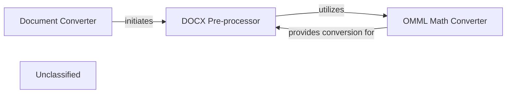

## Details

The Markitdown conversion system is structured around a pipeline that processes various document formats. At its core, the `Document Converter` component initiates the conversion workflow, delegating format-specific pre-processing tasks to specialized components. For DOCX documents, the `DOCX Pre-processor` handles initial transformations, primarily focusing on converting mathematical content. This pre-processor, in turn, utilizes the `OMML Math Converter` to translate Office Math Markup Language into LaTeX, ensuring accurate representation of equations in the final output. This modular design allows for extensible support of different document types and their unique pre-processing requirements.

### Document Converter
This is a higher-level component that manages the overall document conversion pipeline. It is responsible for initiating the conversion process for various document formats, including DOCX, by invoking format-specific pre-processing components like the `DOCX Pre-processor` as part of its workflow.

**Related Classes/Methods**:

- <a href="https://github.com/microsoft/markitdown/blob/main/packages/markitdown/src/markitdown/converters/_doc_intel_converter.py" target="_blank" rel="noopener noreferrer">`markitdown.converters._doc_intel_converter`</a>

### DOCX Pre-processor
This component is responsible for orchestrating the initial pre-processing steps required for DOCX documents before their main conversion. Its primary role is to identify and prepare specific elements, such as mathematical equations, ensuring the content is in a suitable state for subsequent conversion stages. It acts as the entry point for DOCX-specific transformations.

**Related Classes/Methods**:

- <a href="https://github.com/microsoft/markitdown/blob/main/packages/markitdown/src/markitdown/converter_utils/docx/pre_process.py#L118-L156" target="_blank" rel="noopener noreferrer">`markitdown.converter_utils.docx.pre_process.pre_process_docx`:118-156</a>

### OMML Math Converter
Specializing in mathematical content, this utility component provides the core logic for converting Office Math Markup Language (OMML) XML structures, commonly embedded within DOCX documents, into their equivalent LaTeX representations. Its scope is strictly limited to the mathematical conversion aspect.

**Related Classes/Methods**:

- `markitdown.converter_utils.docx.math.omml.oMath22Latex`:170-300

### Unclassified
Component for all unclassified files and utility functions (Utility functions/External Libraries/Dependencies)

**Related Classes/Methods**: _None_

### [FAQ](https://github.com/CodeBoarding/GeneratedOnBoardings/tree/main?tab=readme-ov-file#faq)