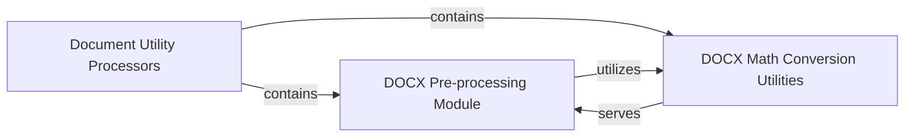

## Details

The Document Utility Processors subsystem is primarily encapsulated within the packages.markitdown.src.markitdown.converter_utils.docx package. This boundary defines a collection of specialized utilities focused on pre-processing and preparing DOCX documents for the main conversion pipeline.

### Document Utility Processors [[Expand]](./Document_Utility_Processors.md)
This overarching component provides specialized utility functions and pre-processing logic tailored for various document formats, specifically focusing on preparing content for the core conversion engine. It acts as a set of specialized tools within the `markitdown` library, aligning with the "Data Preprocessing Tool" and "Utility Library/Toolkit" patterns.

**Related Classes/Methods**:

- <a href="https://github.com/microsoft/markitdown/blob/main/packages/markitdown/src/markitdown/converter_utils/docx" target="_blank" rel="noopener noreferrer">`packages.markitdown.src.markitdown.converter_utils.docx`</a>

### DOCX Pre-processing Module
This module is responsible for performing initial cleaning, normalization, and structural adjustments to DOCX content. Its role is crucial in preparing the document's structure and text for further processing, acting as a primary pre-processor within the `Document Utility Processors` subsystem.

**Related Classes/Methods**:

- <a href="https://github.com/microsoft/markitdown/blob/main/packages/markitdown/src/markitdown/converter_utils/docx/pre_process.py" target="_blank" rel="noopener noreferrer">`packages.markitdown.src.markitdown.converter_utils.docx.pre_process`</a>

### DOCX Math Conversion Utilities
This component handles mathematical expressions embedded within DOCX documents. It is responsible for converting these expressions between different formats, such as OMML (Office Math Markup Language) and LaTeX, ensuring mathematical content is correctly represented and processed.

**Related Classes/Methods**:

- <a href="https://github.com/microsoft/markitdown/blob/main/packages/markitdown/src/markitdown/converter_utils/docx/math/latex_dict.py" target="_blank" rel="noopener noreferrer">`packages.markitdown.src.markitdown.converter_utils.docx.math.latex_dict`</a>
- <a href="https://github.com/microsoft/markitdown/blob/main/packages/markitdown/src/markitdown/converter_utils/docx/math/omml.py" target="_blank" rel="noopener noreferrer">`packages.markitdown.src.markitdown.converter_utils.docx.math.omml`</a>

### [FAQ](https://github.com/CodeBoarding/GeneratedOnBoardings/tree/main?tab=readme-ov-file#faq)