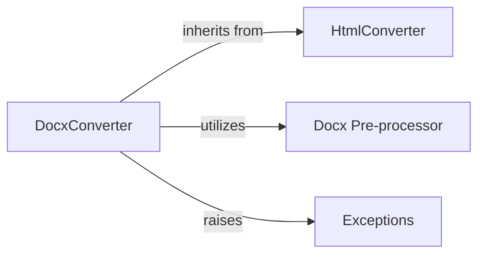

## Component Details

Analysis of the DocxConverter component and its interactions within the MarkItDown system, focusing on its role in converting .docx files to Markdown.

### DocxConverter
This concrete DocumentConverter (markitdown.converters._docx_converter.py) handles the complex conversion of .docx files to Markdown. It orchestrates the process, which involves pre-processing the DOCX content (e.g., handling mathematical equations via Docx Pre-processing Utilities) and then passing the prepared content to an internal instance of HtmlConverter for the final Markdown generation.

**Related Classes/Methods**:

- `HtmlConverter` (1:1)
- `pre_process_docx` (1:1)
- `MissingDependencyException` (1:1)

### HtmlConverter
A component responsible for converting HTML content to Markdown, which DocxConverter leverages.

**Related Classes/Methods**: _None_

### Docx Pre-processor
A utility component responsible for pre-processing DOCX content, including handling mathematical equations, before it's passed for HTML conversion.

**Related Classes/Methods**: _None_

### Exceptions
A component that defines and manages exceptions within the MarkItDown system, such as MissingDependencyException.

**Related Classes/Methods**: _None_

### [FAQ](https://github.com/CodeBoarding/GeneratedOnBoardings/tree/main?tab=readme-ov-file#faq)