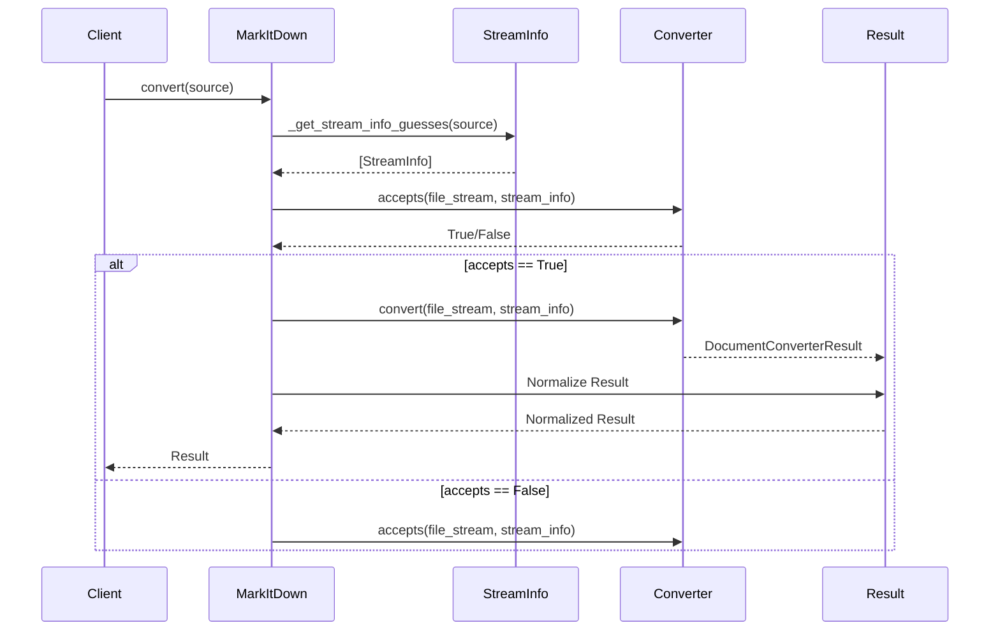
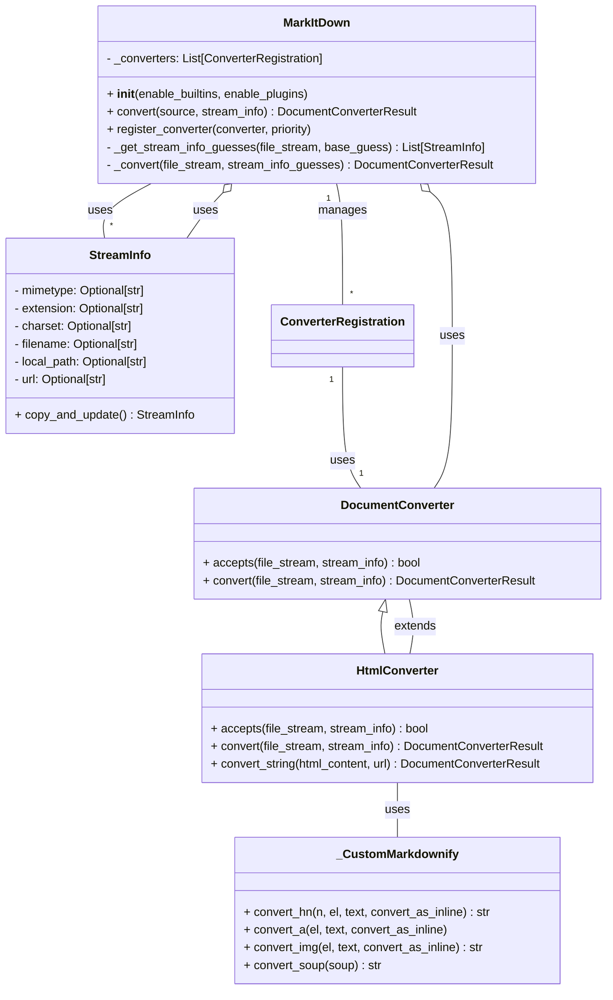

Based on the provided information and the source code analysis, here's a breakdown of the `markitdown` component:

**Component Description:**

The `markitdown` component is a versatile document conversion tool that transforms various file formats and web content into Markdown. It orchestrates the conversion process, manages input streams, leverages specialized converters for different file types, and handles potential errors gracefully. The core functionality resides in the `MarkItDown` class, which acts as the central hub for managing converters and executing the conversion pipeline.

**Main Classes and Their Purposes:**

1.  **`MarkItDown`**: The main class responsible for managing the conversion process. It handles converter registration, stream input, and invokes the appropriate converter based on file type detection.
2.  **`DocumentConverter`**: An abstract base class for all file-type-specific converters. Subclasses implement the `accepts` method to determine if they can handle a given file and the `convert` method to perform the actual conversion.
3.  **`StreamInfo`**: A data class that encapsulates metadata about the input stream, such as MIME type, file extension, charset, filename, and URL. This information is crucial for selecting the appropriate converter and handling the conversion process.
4.  **`HtmlConverter`**: A concrete `DocumentConverter` that specializes in converting HTML content to Markdown. It uses `BeautifulSoup` for parsing HTML and `_CustomMarkdownify` for the actual Markdown conversion.
5.  **`_CustomMarkdownify`**: A customized version of the `markdownify` library's `MarkdownConverter`. It provides specific rules and configurations for converting HTML elements to Markdown, such as handling headings, links, and images.

**Main Flow (Sequence Diagram):**

**Component Structure (Class Diagram):**

