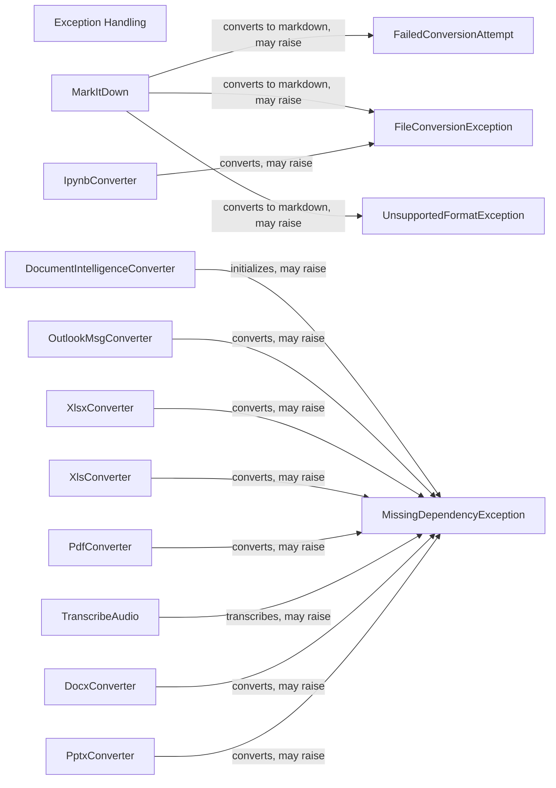

## Component Details

### Exception Handling
Defines custom exceptions for file conversion failures.
- **Related Classes/Methods**: `markitdown._exceptions.FailedConversionAttempt`, `markitdown._exceptions.FileConversionException`, `markitdown._exceptions.UnsupportedFormatException`

### MarkItDown
The main class responsible for converting files from various formats to markdown. It orchestrates the conversion process by selecting the appropriate converter and handling exceptions.
- **Related Classes/Methods**: `markitdown._markitdown.MarkItDown:convert_local`, `markitdown._markitdown.MarkItDown:convert_response`, `markitdown._markitdown.MarkItDown:convert_stream`, `markitdown._markitdown.MarkItDown:convert_uri`, `markitdown._markitdown.MarkItDown:convert_url`

### DocumentIntelligenceConverter
Converter for documents using Document Intelligence. It converts documents to markdown using Azure's Document Intelligence service and raises a MissingDependencyException if the required dependencies are not installed.
- **Related Classes/Methods**: `markitdown.converters._doc_intel_converter.DocumentIntelligenceConverter:__init__`

### OutlookMsgConverter
Converter for Outlook message files. It converts Outlook message files to markdown and raises a MissingDependencyException if the required dependencies are not installed.
- **Related Classes/Methods**: `markitdown.converters._outlook_msg_converter.OutlookMsgConverter:convert`

### XlsxConverter
Converter for Excel files (xlsx). It converts modern Excel files to markdown and raises a MissingDependencyException if the required dependencies are not installed.
- **Related Classes/Methods**: `markitdown.converters._xlsx_converter.XlsxConverter:convert`

### XlsConverter
Converter for older Excel files (xls). It converts legacy Excel files to markdown and raises a MissingDependencyException if the required dependencies are not installed.
- **Related Classes/Methods**: `markitdown.converters._xlsx_converter.XlsConverter:convert`

### PdfConverter
Converter for PDF files. It converts PDF files to markdown and raises a MissingDependencyException if the required dependencies are not installed.
- **Related Classes/Methods**: `markitdown.converters._pdf_converter.PdfConverter:convert`

### TranscribeAudio
Function to transcribe audio files. It transcribes audio files to text and raises a MissingDependencyException if the required dependencies are not installed.
- **Related Classes/Methods**: `markitdown.converters._transcribe_audio:transcribe_audio`

### IpynbConverter
Converter for Jupyter Notebook files. It converts Jupyter Notebook files to markdown and may raise a FileConversionException if the conversion fails.
- **Related Classes/Methods**: `markitdown.converters._ipynb_converter.IpynbConverter:_convert`

### DocxConverter
Converter for Word documents. It converts Word documents to markdown and raises a MissingDependencyException if the required dependencies are not installed.
- **Related Classes/Methods**: `markitdown.converters._docx_converter.DocxConverter:convert`

### PptxConverter
Converter for PowerPoint presentations. It converts PowerPoint presentations to markdown and raises a MissingDependencyException if the required dependencies are not installed.
- **Related Classes/Methods**: `markitdown.converters._pptx_converter.PptxConverter:convert`

### MissingDependencyException
Exception raised when a required dependency is missing. It indicates that a required library or tool is not installed.
- **Related Classes/Methods**: `markitdown._exceptions.MissingDependencyException`
