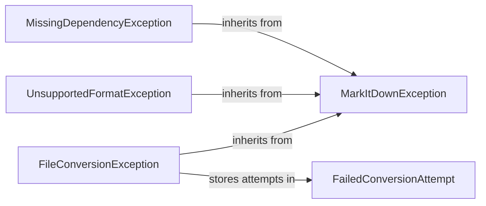

## Component Details

### MarkItDownException
Base exception class for all custom exceptions in MarkItDown.
- **Related Classes/Methods**: `repos.markitdown.packages.markitdown.src.markitdown._exceptions`

### MissingDependencyException
Exception raised when a required dependency for a converter is missing. It inherits from MarkItDownException.
- **Related Classes/Methods**: `repos.markitdown.packages.markitdown.src.markitdown._exceptions`

### UnsupportedFormatException
Exception raised when no suitable converter is found for the given file. It inherits from MarkItDownException.
- **Related Classes/Methods**: `repos.markitdown.packages.markitdown.src.markitdown._exceptions`

### FailedConversionAttempt
Represents a single attempt to convert a file, storing the converter and any exception information.
- **Related Classes/Methods**: `repos.markitdown.packages.markitdown.src.markitdown._exceptions`

### FileConversionException
Exception raised when a suitable converter is found, but the conversion process fails. It inherits from MarkItDownException and stores a list of FailedConversionAttempt instances.
- **Related Classes/Methods**: `repos.markitdown.packages.markitdown.src.markitdown._exceptions`
