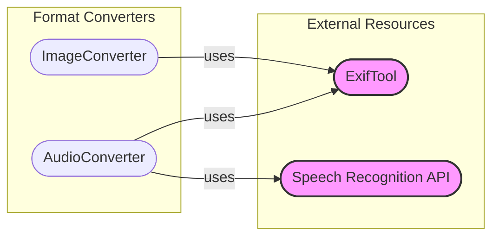

## External Resource Accessors Overview

This component provides access to external tools and resources required by the Format Converters. It provides resources to the Format Converters.

## Components

- **ExifTool**
  - *Description*: Extracts metadata from files. It is an external command-line tool.
  - *Interaction*: `ImageConverter` and `AudioConverter` use it to extract metadata from image and audio files, respectively.
  - *Relevant source files*:
    - `repos.markitdown.packages.markitdown.src.markitdown.converters._exiftool.exiftool_metadata`

- **Speech Recognition API**
  - *Description*: Transcribes audio files to text. It is an external API provided by Google.
  - *Interaction*: `AudioConverter` uses it to transcribe audio content.
  - *Relevant source files*:
    - `repos.markitdown.packages.markitdown.src.markitdown.converters._transcribe_audio.transcribe_audio`
