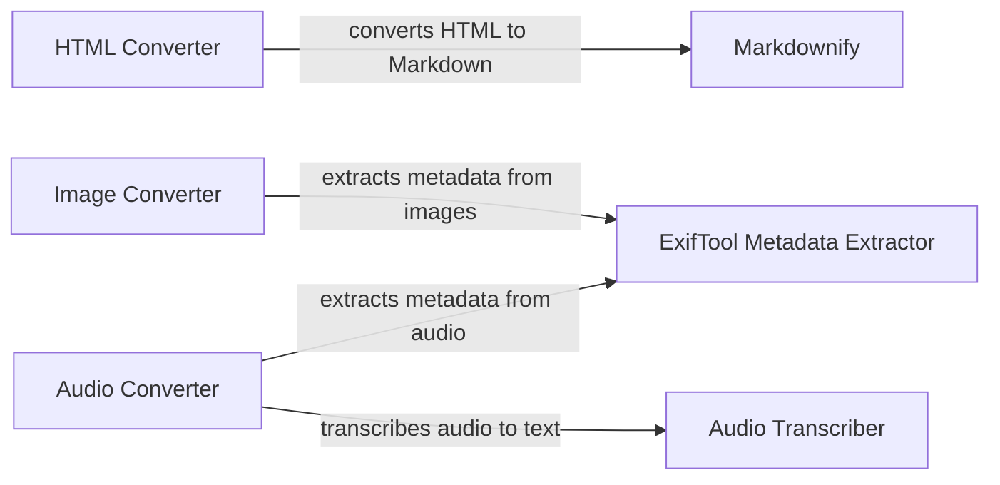

## Component Details

### Markdownify
Markdownify is a tool used for converting HTML content into Markdown format. It provides a way to extract the textual content and structure from HTML documents and represent them in a more readable and easily editable Markdown format. The `_CustomMarkdownify` class extends the functionality of the base Markdownify library.
- **Related Classes/Methods**: `repos.markitdown.packages.markitdown.src.markitdown.converters._markdownify._CustomMarkdownify`

### ExifTool Metadata Extractor
ExifTool is a tool used for extracting metadata from various file types, including images and audio files. It allows the converters to gather information such as creation date, author, camera settings, and other relevant details embedded within the files. The `exiftool_metadata` function is used to call the tool.
- **Related Classes/Methods**: `repos.markitdown.packages.markitdown.src.markitdown.converters._exiftool.exiftool_metadata`

### Audio Transcriber
The Audio Transcriber component is responsible for converting audio files into text. It uses a speech-to-text engine to transcribe the spoken content of the audio file, enabling the converter to include a textual representation of the audio in the final Markdown output. The `transcribe_audio` function handles the transcription process.
- **Related Classes/Methods**: `repos.markitdown.packages.markitdown.src.markitdown.converters._transcribe_audio.transcribe_audio`

### HTML Converter
The HTML Converter component is responsible for converting HTML content to Markdown format. It uses the `Markdownify` tool to extract the textual content and structure from HTML documents and represent them in a more readable and easily editable Markdown format.
- **Related Classes/Methods**: `repos.markitdown.packages.markitdown.src.markitdown.converters._html_converter.HtmlConverter`

### Image Converter
The Image Converter component is responsible for converting images to Markdown format. It uses the `ExifTool Metadata Extractor` to extract metadata from the image files.
- **Related Classes/Methods**: `repos.markitdown.packages.markitdown.src.markitdown.converters._image_converter.ImageConverter`

### Audio Converter
The Audio Converter component is responsible for converting audio files to Markdown format. It uses the `ExifTool Metadata Extractor` to extract metadata from the audio files and the `Audio Transcriber` to transcribe the audio content.
- **Related Classes/Methods**: `repos.markitdown.packages.markitdown.src.markitdown.converters._audio_converter.AudioConverter`
