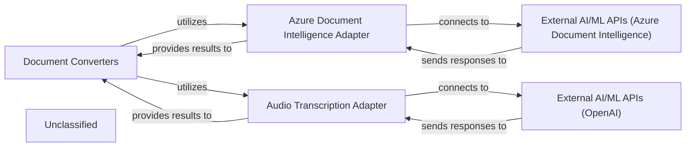

## Details

The `markitdown` project's conversion subsystem is designed to transform various document types into Markdown, leveraging external AI/ML services for enhanced processing. The core `Document Converters` component orchestrates this process, acting as a client to specialized adapters. The `Azure Document Intelligence Adapter` facilitates interaction with the `External AI/ML APIs (Azure Document Intelligence)` for advanced document analysis, while the `Audio Transcription Adapter` interfaces with `External AI/ML APIs (OpenAI)` for transcribing audio content. These adapters abstract the complexities of external API communication, providing structured results back to the `Document Converters`. This architecture ensures a clear separation of concerns, allowing the core conversion logic to remain independent of specific external service implementations.

### Document Converters [[Expand]](./Document_Converters.md)
This component is responsible for converting various document types into Markdown. It acts as the primary client for the AI/ML service adapters, orchestrating when and how to leverage external AI/ML capabilities to enhance the conversion process.

**Related Classes/Methods**:

- `markitdown.converters._transcribe_audio`

### Azure Document Intelligence Adapter
An adapter specifically designed to interface with the Azure Document Intelligence API. It handles the communication protocol, authentication, request formatting, and response parsing for sending documents to Azure for advanced analysis and receiving structured data.

**Related Classes/Methods**:

### Audio Transcription Adapter
An adapter responsible for interacting with external audio transcription services (e.g., OpenAI's Whisper API). It manages the submission of audio streams and the retrieval of transcribed text, abstracting the external API details from the core conversion logic.

**Related Classes/Methods**:

### External AI/ML APIs (Azure Document Intelligence)
Represents the actual cloud-based Azure Document Intelligence service. This external dependency provides advanced capabilities for extracting layout, text, and structure from various document formats. This is an external service and not directly represented by internal code.

**Related Classes/Methods**:

### External AI/ML APIs (OpenAI)
Represents the actual cloud-based OpenAI service, specifically utilized by the `Audio Transcription Adapter` for converting audio streams into text. This is an external service and not directly represented by internal code.

**Related Classes/Methods**:

- `OpenAI API (External Service)`:1-10

### Unclassified
Component for all unclassified files and utility functions (Utility functions/External Libraries/Dependencies)

**Related Classes/Methods**: _None_

### [FAQ](https://github.com/CodeBoarding/GeneratedOnBoardings/tree/main?tab=readme-ov-file#faq)