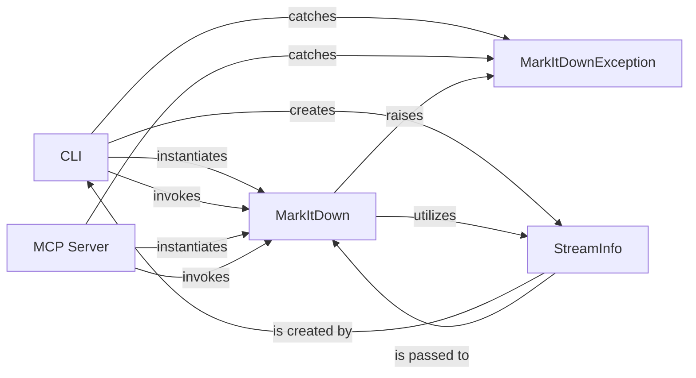

## Details

One paragraph explaining the functionality which is represented by this graph. What the main flow is and what is its purpose.

### CLI
This component provides the primary command-line interface for users to directly interact with the `markitdown` library. It serves as an entry point for executing document conversions and other library functionalities from the terminal, parsing user arguments, and invoking the core `MarkItDown` orchestrator.

**Related Classes/Methods**:

- <a href="https://github.com/microsoft/markitdown/blob/main/temp/packages/markitdown/src/markitdown/__main__.py#L12-L199" target="_blank" rel="noopener noreferrer">`markitdown.__main__.main` (12:199)</a>

### MCP Server
This component establishes a server-side platform that exposes the `markitdown` library's conversion capabilities via an API. It enables other systems or applications to remotely request and receive document conversions, facilitating integration into larger, distributed architectures. This aligns with the "Client-Server" pattern, providing a programmatic interface beyond the CLI.

**Related Classes/Methods**:

- <a href="https://github.com/microsoft/markitdown/blob/main/temp/packages/markitdown-mcp/src/markitdown_mcp/__main__.py#L81-L122" target="_blank" rel="noopener noreferrer">`markitdown_mcp.__main__.main` (81:122)</a>

### MarkItDown
This is the central orchestrator of the `markitdown` library, acting as a facade to simplify the complex document conversion process. It dispatches conversion tasks to appropriate internal converters and manages plugin integration.

**Related Classes/Methods**:

- <a href="https://github.com/microsoft/markitdown/blob/main/temp/packages/markitdown/src/markitdown/_markitdown.py#L92-L770" target="_blank" rel="noopener noreferrer">`markitdown._markitdown.MarkItDown` (92:770)</a>

### StreamInfo
A data structure used to encapsulate metadata about an input stream or file, such as its extension, MIME type, and character set. This information helps the `MarkItDown` core select the appropriate converter, especially when processing input from standard streams where file type cannot be inferred from a filename.

**Related Classes/Methods**:

- <a href="https://github.com/microsoft/markitdown/blob/main/temp/packages/markitdown/src/markitdown/_stream_info.py#L5-L31" target="_blank" rel="noopener noreferrer">`markitdown._stream_info.StreamInfo` (5:31)</a>

### MarkItDownException
This component defines custom exception types specific to the `markitdown` library. These exceptions provide structured error reporting for various issues that may arise during document conversion, such as invalid input, conversion failures, or plugin-related problems.

**Related Classes/Methods**:

- <a href="https://github.com/microsoft/markitdown/blob/main/temp/packages/markitdown/src/markitdown/_exceptions.py#L10-L15" target="_blank" rel="noopener noreferrer">`markitdown._exceptions.MarkItDownException` (10:15)</a>

### [FAQ](https://github.com/CodeBoarding/GeneratedOnBoardings/tree/main?tab=readme-ov-file#faq)