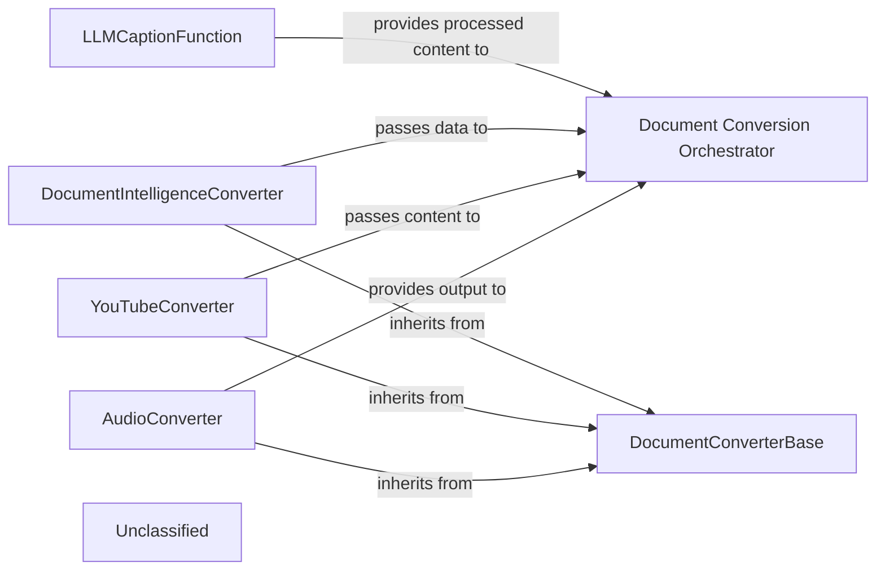

## Details

The `markitdown` conversion subsystem is designed around a flexible and extensible architecture, centered on the `Document Conversion Orchestrator`. This orchestrator acts as the central hub, receiving various input streams and intelligently delegating the conversion task to specialized `DocumentConverter` implementations. Each specialized converter, such as `AudioConverter`, `YouTubeConverter`, and `DocumentIntelligenceConverter`, inherits from the `DocumentConverterBase` class, ensuring a consistent interface for the orchestrator. These converters encapsulate the logic for interacting with external services (e.g., audio transcription, YouTube API, Azure Document Intelligence) and transforming their outputs into a standardized Markdown format. The `LLMCaptionFunction` provides additional LLM-based processing capabilities. This design promotes modularity, allowing for easy integration of new conversion capabilities and efficient processing of diverse document types.

### AudioConverter
Handles the conversion of audio input by leveraging an external audio transcription service. It encapsulates the logic for making API calls to this service and processing its responses.

**Related Classes/Methods**:

- <a href="https://github.com/microsoft/markitdown/blob/mainpackages/markitdown/src/markitdown/converters/_audio_converter.py#L23-L101" target="_blank" rel="noopener noreferrer">`markitdown.converters.AudioConverter`:23-101</a>

### YouTubeConverter
Processes YouTube video content, interacting with the YouTube API to retrieve video metadata, transcripts, or other relevant information for conversion.

**Related Classes/Methods**:

- <a href="https://github.com/microsoft/markitdown/blob/mainpackages/markitdown/src/markitdown/converters/_youtube_converter.py#L37-L238" target="_blank" rel="noopener noreferrer">`markitdown.converters.YouTubeConverter`:37-238</a>

### DocumentIntelligenceConverter
Integrates with Azure Document Intelligence to extract structured information from various document types (e.g., PDFs, images). It encapsulates the logic for calling the Azure service and parsing its output.

**Related Classes/Methods**:

- <a href="https://github.com/microsoft/markitdown/blob/mainpackages/markitdown/src/markitdown/converters/_doc_intel_converter.py#L130-L254" target="_blank" rel="noopener noreferrer">`markitdown.converters.DocumentIntelligenceConverter`:130-254</a>

### LLMCaptionFunction
Utilizes an external Large Language Model (LLM) service (e.g., OpenAI) for tasks such as generating captions, summaries, or performing other LLM-based processing on input content.

**Related Classes/Methods**:

- `markitdown.converters.llm_caption`:7-50

### DocumentConverterBase
Defines a common interface and foundational structure for all converter components within the system, ensuring consistency and extensibility. It acts as an abstraction layer for the `Document Conversion Orchestrator` to interact with various external service clients uniformly.

**Related Classes/Methods**:

- <a href="https://github.com/microsoft/markitdown/blob/mainpackages/markitdown/src/markitdown/_base_converter.py#L42-L105" target="_blank" rel="noopener noreferrer">`markitdown._base_converter.DocumentConverter`:42-105</a>

### Document Conversion Orchestrator
This central component is responsible for selecting the appropriate `DocumentConverter` based on the input `StreamInfo` and orchestrating the conversion process. It receives input streams, delegates to specialized converters, and returns the `DocumentConverterResult`.

**Related Classes/Methods**:

### Unclassified
Component for all unclassified files and utility functions (Utility functions/External Libraries/Dependencies)

**Related Classes/Methods**: _None_

### [FAQ](https://github.com/CodeBoarding/GeneratedOnBoardings/tree/main?tab=readme-ov-file#faq)