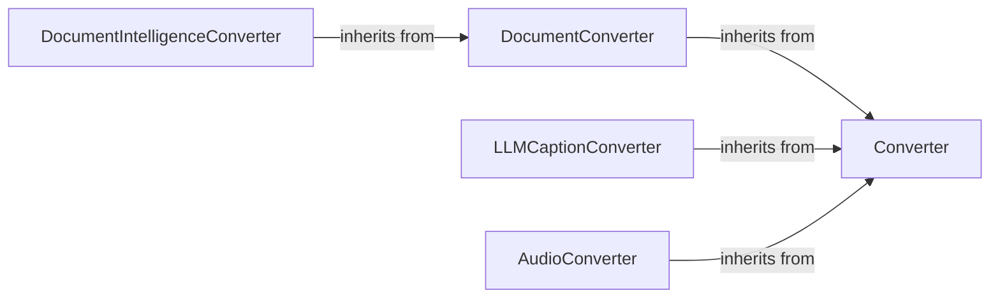

## Details

The `markitdown` converter subsystem provides a modular and extensible framework for transforming diverse content into markdown. It leverages a clear inheritance hierarchy, starting with the abstract `Converter` and `DocumentConverter` classes, to establish a consistent interface for all conversion operations. Specialized converters, such as `DocumentIntelligenceConverter`, `LLMCaptionConverter`, and `AudioConverter`, encapsulate the logic for interacting with specific external APIs and tools (e.g., Azure Document Intelligence, LLMs, audio transcription services). This design allows for easy integration of new content types and conversion methods, with each converter responsible for its specific input acceptance criteria, external service communication, and the final generation of markdown output. The system's main flow involves selecting the appropriate converter based on input type, executing its conversion logic, and producing standardized markdown.

### Converter
The foundational abstract base class for all converters, defining the `convert` method interface.

**Related Classes/Methods**:

### DocumentConverter
An abstract base class extending `Converter`, specifically tailored for document processing.

**Related Classes/Methods**:

### DocumentIntelligenceConverter
Converts various document formats (DOCX, PPTX, XLSX, PDF, images) into markdown by integrating with Azure Document Intelligence, handling authentication and feature selection.

**Related Classes/Methods**:

- <a href="https://github.com/microsoft/markitdown/blob/main/packages/markitdown/src/markitdown/converters/_doc_intel_converter.py#L124-L248" target="_blank" rel="noopener noreferrer">`markitdown.converters._doc_intel_converter.DocumentIntelligenceConverter`:124-248)</a>

### LLMCaptionConverter
Generates captions or summaries for content by interacting with an external Large Language Model (LLM) service, integrating the generated text into markdown.

**Related Classes/Methods**:

### AudioConverter
Converts audio content into textual markdown by utilizing external audio processing or transcription services, including metadata extraction.

**Related Classes/Methods**:

- <a href="https://github.com/microsoft/markitdown/blob/main/packages/markitdown/src/markitdown/converters/_audio_converter.py#L22-L100" target="_blank" rel="noopener noreferrer">`markitdown.converters._audio_converter.AudioConverter`:22-100)</a>

### [FAQ](https://github.com/CodeBoarding/GeneratedOnBoardings/tree/main?tab=readme-ov-file#faq)