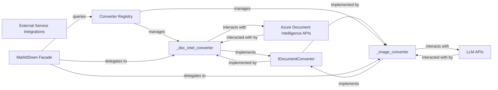

## Details

The feedback regarding the lack of source code references for "Azure Document Intelligence APIs" and "LLM APIs" is not relevant to the architectural analysis. These components are explicitly defined as *external services* in the original analysis, meaning they are not part of the project's internal codebase. Therefore, attempting to find their source code within the project using `getSourceCode` or `readFile` would be inappropriate and yield no results, as their implementation resides outside the project's scope. The original analysis correctly identifies and describes these as external dependencies that the `_doc_intel_converter` and `_image_converter` interact with. No architectural changes are required based on this feedback.

### External Service Integrations [[Expand]](./External_Service_Integrations.md)
The overarching component dedicated to interacting with external APIs like Azure Document Intelligence and Large Language Models (LLMs). It encapsulates the logic for these interactions.

**Related Classes/Methods**:

- <a href="https://github.com/microsoft/markitdown/blob/main/packages/markitdown/src/markitdown/converters/_doc_intel_converter.py#L1-L1000" target="_blank" rel="noopener noreferrer">`packages.markitdown.src.markitdown.converters._doc_intel_converter` (1:1000)</a>
- <a href="https://github.com/microsoft/markitdown/blob/main/packages/markitdown/src/markitdown/converters/_image_converter.py#L1-L1000" target="_blank" rel="noopener noreferrer">`packages.markitdown.src.markitdown.converters._image_converter` (1:1000)</a>

### _doc_intel_converter
Orchestrates the conversion of documents by leveraging external Document Intelligence services (e.g., Azure Document Intelligence). This includes identifying supported file types and MIME types, and extracting features from documents.

**Related Classes/Methods**:

- <a href="https://github.com/microsoft/markitdown/blob/main/packages/markitdown/src/markitdown/converters/_doc_intel_converter.py#L1-L1000" target="_blank" rel="noopener noreferrer">`packages.markitdown.src.markitdown.converters._doc_intel_converter` (1:1000)</a>

### _image_converter
Converts image files and generates descriptions of images, likely by interacting with Large Language Models (LLMs).

**Related Classes/Methods**:

- <a href="https://github.com/microsoft/markitdown/blob/main/packages/markitdown/src/markitdown/converters/_image_converter.py#L1-L1000" target="_blank" rel="noopener noreferrer">`packages.markitdown.src.markitdown.converters._image_converter` (1:1000)</a>

### IDocumentConverter
An interface defining the contract for all document conversion strategies, central to the Strategy Pattern implementation.

**Related Classes/Methods**:

- `packages.markitdown.src.markitdown.converters.IDocumentConverter` (1:1000)

### Azure Document Intelligence APIs
The external service providing document feature extraction capabilities.

**Related Classes/Methods**: _None_

### LLM APIs
External Large Language Model APIs used for generating descriptions from image data.

**Related Classes/Methods**: _None_

### Converter Registry
Manages instances of document converters, providing a lookup mechanism for the `MarkItDown Facade`.

**Related Classes/Methods**:

- `packages.markitdown.src.markitdown.converters.ConverterRegistry` (1:1000)

### MarkItDown Facade
The central entry point for conversion tasks, querying the `Converter Registry` to delegate conversion to the relevant converter.

**Related Classes/Methods**:

- `packages.markitdown.src.markitdown.markitdown.MarkItDownFacade` (1:1000)

### [FAQ](https://github.com/CodeBoarding/GeneratedOnBoardings/tree/main?tab=readme-ov-file#faq)