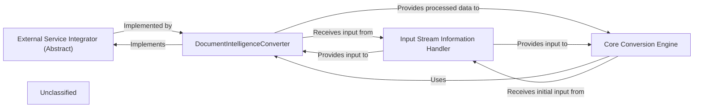

## Details

This system is designed to convert documents into a Markdown-compatible format, leveraging external cloud-based services for advanced processing. The main flow involves an Input Stream Information Handler providing raw document data to a Core Conversion Engine, which orchestrates the conversion. The Core Conversion Engine can utilize various External Service Integrators, such as the DocumentIntelligenceConverter, to send documents to external services like Azure Document Intelligence for OCR and layout analysis. These integrators process the data and return structured results to the Core Conversion Engine, which then integrates them into the final Markdown output. The system emphasizes modularity through an abstract interface for external service integrations.

### External Service Integrator (Abstract)
Defines the abstract interface and contract for integrating with various external cloud-based services. This component is crucial for maintaining a modular and extensible architecture, allowing new service integrations to be added without altering the core system. It ensures a consistent way for the Core Conversion Engine to interact with different external processing capabilities.

**Related Classes/Methods**:

- <a href="https://github.com/microsoft/markitdown/blob/main/packages/markitdown/src/markitdown/_base_converter.py#L42-L105" target="_blank" rel="noopener noreferrer">`markitdown._base_converter.DocumentConverter`:42-105</a>

### DocumentIntelligenceConverter
A concrete implementation of the External Service Integrator specifically designed for Azure Document Intelligence. Its responsibilities include handling authentication with Azure, sending documents for advanced OCR and layout analysis, parsing the structured results returned by the service, and transforming this data into a Markdown-compatible format for further processing within markitdown.

**Related Classes/Methods**:

- <a href="https://github.com/microsoft/markitdown/blob/main/packages/markitdown/src/markitdown/converters/_doc_intel_converter.py#L130-L254" target="_blank" rel="noopener noreferrer">`markitdown.converters._doc_intel_converter.DocumentIntelligenceConverter`:130-254</a>

### Core Conversion Engine
The central orchestrator of the entire document conversion workflow. It is responsible for coordinating the various stages of conversion, including invoking specific External Service Integrators (like DocumentIntelligenceConverter) when external processing is required. It acts as the primary client for these integrators, receiving processed data and integrating it into the final Markdown output.

**Related Classes/Methods**:

- <a href="https://github.com/microsoft/markitdown/blob/main/packages/markitdown/src/markitdown/_markitdown.py#L93-L776" target="_blank" rel="noopener noreferrer">`markitdown._markitdown.MarkItDown`:93-776</a>

### Input Stream Information Handler
Manages and provides access to the raw input document data, whether it's file content, a file path, or a stream. This component serves as the source of truth for the document being processed, supplying the necessary input to both the Core Conversion Engine and directly to External Service Integrators that need to send the document content to external services.

**Related Classes/Methods**:

- <a href="https://github.com/microsoft/markitdown/blob/main/packages/markitdown/src/markitdown/_stream_info.py#L5-L32" target="_blank" rel="noopener noreferrer">`markitdown._stream_info.StreamInfo`:5-32</a>

### Unclassified
Component for all unclassified files and utility functions (Utility functions/External Libraries/Dependencies)

**Related Classes/Methods**: _None_

### [FAQ](https://github.com/CodeBoarding/GeneratedOnBoardings/tree/main?tab=readme-ov-file#faq)