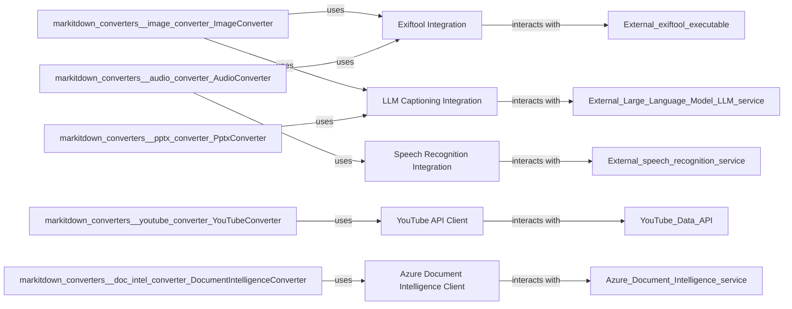

## Component Details

The `External Services/Libraries` component in `markitdown` acts as a crucial bridge, enabling the system to leverage specialized external tools and APIs for advanced document and media processing. These integrations are fundamental because they extend `markitdown`'s capabilities beyond basic text extraction, allowing it to handle complex media types, extract rich metadata, and generate AI-powered insights, which would be impractical or impossible to implement natively.

### Exiftool Integration
This component provides a direct interface to the external `exiftool` command-line utility. Its primary responsibility is to execute `exiftool` commands on binary file streams to extract comprehensive metadata (e.g., EXIF data from images, audio properties) and parse the structured JSON output. It encapsulates the logic for interacting with this external executable.

**Related Classes/Methods**:

- <a href="https://github.com/microsoft/markitdown/blob/master/packages/markitdown/src/markitdown/converters/_exiftool.py#L0-L0" target="_blank" rel="noopener noreferrer">`markitdown.converters._exiftool` (0:0)</a>

### Speech Recognition Integration
This component is responsible for transcribing audio content into text. It leverages external Python libraries like `speech_recognition` and `pydub` to handle various audio formats, convert them to a suitable format (e.g., WAV), and then use a speech-to-text service (like Google Web Speech API) to generate a textual transcript.

**Related Classes/Methods**:

- <a href="https://github.com/microsoft/markitdown/blob/master/packages/markitdown/src/markitdown/converters/_transcribe_audio.py#L0-L0" target="_blank" rel="noopener noreferrer">`markitdown.converters._transcribe_audio` (0:0)</a>

### YouTube API Client
This component, primarily embodied by the `YouTubeConverter` class, manages the extraction of information from YouTube video pages. It parses the HTML to retrieve video metadata (title, description, views, keywords, runtime) and, crucially, integrates with the `youtube_transcript_api` to fetch available video transcripts. It handles the specific logic for identifying YouTube URLs and structuring the extracted data.

**Related Classes/Methods**:

- <a href="https://github.com/microsoft/markitdown/blob/master/packages/markitdown/src/markitdown/converters/_youtube_converter.py#L36-L237" target="_blank" rel="noopener noreferrer">`markitdown.converters._youtube_converter.YouTubeConverter` (36:237)</a>

### Azure Document Intelligence Client
This component, implemented by the `DocumentIntelligenceConverter` class, facilitates interaction with the Azure Document Intelligence service. It's designed to send various document types (e.g., DOCX, PPTX, XLSX, PDF, images) to Azure for advanced analysis, including OCR, layout understanding, and key-value pair extraction. It handles authentication with Azure and processes the service's structured output.

**Related Classes/Methods**:

- <a href="https://github.com/microsoft/markitdown/blob/master/packages/markitdown/src/markitdown/converters/_doc_intel_converter.py#L124-L248" target="_blank" rel="noopener noreferrer">`markitdown.converters._doc_intel_converter.DocumentIntelligenceConverter` (124:248)</a>

### LLM Captioning Integration
This component offers a generic interface for generating descriptive captions or summaries for images using a Large Language Model (LLM). It prepares image data by converting it to a base64 data URI and formats the request for an LLM client (e.g., an OpenAI-compatible API), then extracts and returns the generated textual caption.

**Related Classes/Methods**:

- <a href="https://github.com/microsoft/markitdown/blob/master/packages/markitdown/src/markitdown/converters/_llm_caption.py#L0-L0" target="_blank" rel="noopener noreferrer">`markitdown.converters._llm_caption` (0:0)</a>

### [FAQ](https://github.com/CodeBoarding/GeneratedOnBoardings/tree/main?tab=readme-ov-file#faq)