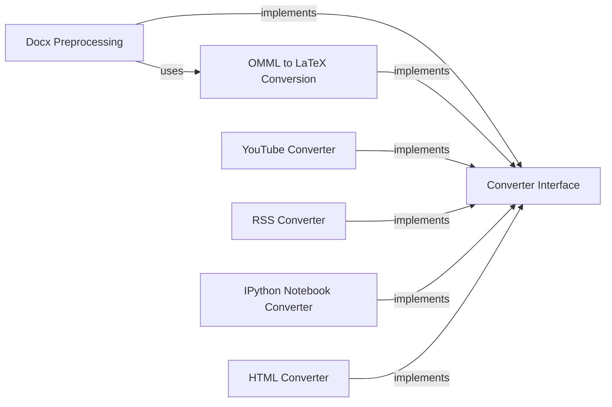

## Component Details

The File Format Converters subsystem is responsible for transforming various file formats into Markdown. It consists of a collection of individual converters, each dedicated to handling a specific file format. These converters implement a common interface, providing a `convert` method that takes an input file and returns its Markdown representation. The subsystem also includes components for preprocessing certain file types, such as DOCX files, to handle specific formatting requirements like mathematical equations. The core functionality revolves around parsing different file formats and converting their content into a structured Markdown output.

### Converter Interface
This abstract component defines the interface for all converters. Each specific converter implements a `convert` method to transform a given input into a markdown format.
- **Related Classes/Methods**: `markitdown.packages.markitdown.src.markitdown.converters._pptx_converter.PptxConverter:convert` (61:188), `markitdown.packages.markitdown.src.markitdown.converters._csv_converter.CsvConverter:convert` (38:77), `markitdown.packages.markitdown.src.markitdown.converters._docx_converter.DocxConverter:convert` (55:80), `markitdown.packages.markitdown.src.markitdown.converters._html_converter.HtmlConverter:convert` (41:71), `markitdown.packages.markitdown.src.markitdown.converters._bing_serp_converter.BingSerpConverter:convert` (57:120), `markitdown.packages.markitdown.src.markitdown.converters._xlsx_converter.XlsxConverter:convert` (63:95), `markitdown.packages.markitdown.src.markitdown.converters._xlsx_converter.XlsConverter:convert` (125:157), `markitdown.packages.markitdown.src.markitdown.converters._youtube_converter.YouTubeConverter:convert` (70:197), `markitdown.packages.markitdown.src.markitdown.converters._wikipedia_converter.WikipediaConverter:convert` (51:87), `markitdown.packages.markitdown.src.markitdown.converters._rss_converter.RssConverter:convert` (84:99), `markitdown.packages.markitdown.src.markitdown.converters._epub_converter.EpubConverter:convert` (53:130), `markitdown.packages.markitdown.src.markitdown.converters._plain_text_converter.PlainTextConverter:convert` (60:71), `markitdown.packages.markitdown.src.markitdown.converters._zip_converter.ZipConverter:convert` (87:116), `markitdown.packages.markitdown.src.markitdown.converters._image_converter.ImageConverter:convert` (39:85), `markitdown.packages.markitdown.src.markitdown.converters._outlook_msg_converter.OutlookMsgConverter:convert` (73:125), `markitdown.packages.markitdown.src.markitdown.converters._pdf_converter.PdfConverter:convert` (54:77), `markitdown.packages.markitdown.src.markitdown.converters._audio_converter.AudioConverter:convert` (46:101), `markitdown.packages.markitdown.src.markitdown.converters._ipynb_converter.IpynbConverter:convert` (46:55), `markitdown.packages.markitdown-sample-plugin.src.markitdown_sample_plugin._plugin.RtfConverter:convert` (57:71)

### Docx Preprocessing
This component focuses on preprocessing DOCX files, specifically handling and converting mathematical equations from OMML format to LaTeX. It includes functions for identifying, extracting, and converting equations within the DOCX structure. The preprocessed DOCX content is then ready for further conversion to Markdown.
- **Related Classes/Methods**: `markitdown.packages.markitdown.src.markitdown.converter_utils.docx.pre_process:_convert_omath_to_latex` (33:49), `markitdown.packages.markitdown.src.markitdown.converter_utils.docx.pre_process:_get_omath_tag_replacement` (52:71), `markitdown.packages.markitdown.src.markitdown.converter_utils.docx.pre_process:_replace_equations` (74:96), `markitdown.packages.markitdown.src.markitdown.converter_utils.docx.pre_process:_pre_process_math` (99:115), `markitdown.packages.markitdown.src.markitdown.converter_utils.docx.pre_process:pre_process_docx` (118:156)

### OMML to LaTeX Conversion
This component is responsible for converting Office Math Markup Language (OMML) equations within DOCX files into LaTeX format. It involves parsing the OMML structure and applying specific rules to generate the corresponding LaTeX representation for each mathematical element.
- **Related Classes/Methods**: `markitdown.packages.markitdown.src.markitdown.converter_utils.docx.math.omml:load` (43:46), `markitdown.packages.markitdown.src.markitdown.converter_utils.docx.math.omml:load_string` (49:52), `markitdown.packages.markitdown.src.markitdown.converter_utils.docx.math.omml.Tag2Method:process_children_list` (86:101), `markitdown.packages.markitdown.src.markitdown.converter_utils.docx.math.omml.Tag2Method:process_children_dict` (103:110), `markitdown.packages.markitdown.src.markitdown.converter_utils.docx.math.omml.Tag2Method:process_children` (112:121), `markitdown.packages.markitdown.src.markitdown.converter_utils.docx.math.omml.Pr:__init__` (136:138), `markitdown.packages.markitdown.src.markitdown.converter_utils.docx.math.omml.Pr:__unicode__` (143:144), `markitdown.packages.markitdown.src.markitdown.converter_utils.docx.math.omml.oMath2Latex:__init__` (179:180), `markitdown.packages.markitdown.src.markitdown.converter_utils.docx.math.omml.oMath2Latex:__unicode__` (185:186), `markitdown.packages.markitdown.src.markitdown.converter_utils.docx.math.omml.oMath2Latex:process_unknow` (188:194), `markitdown.packages.markitdown.src.markitdown.converter_utils.docx.math.omml.oMath2Latex:do_acc` (200:208), `markitdown.packages.markitdown.src.markitdown.converter_utils.docx.math.omml.oMath2Latex:do_bar` (210:217), `markitdown.packages.markitdown.src.markitdown.converter_utils.docx.math.omml.oMath2Latex:do_d` (219:232), `markitdown.packages.markitdown.src.markitdown.converter_utils.docx.math.omml.oMath2Latex:do_sub` (240:242), `markitdown.packages.markitdown.src.markitdown.converter_utils.docx.math.omml.oMath2Latex:do_sup` (244:246), `markitdown.packages.markitdown.src.markitdown.converter_utils.docx.math.omml.oMath2Latex:do_f` (248:255), `markitdown.packages.markitdown.src.markitdown.converter_utils.docx.math.omml.oMath2Latex:do_func` (257:263), `markitdown.packages.markitdown.src.markitdown.converter_utils.docx.math.omml.oMath2Latex:do_fname` (265:279), `markitdown.packages.markitdown.src.markitdown.converter_utils.docx.math.omml.oMath2Latex:do_groupchr` (281:288), `markitdown.packages.markitdown.src.markitdown.converter_utils.docx.math.omml.oMath2Latex:do_rad` (290:300), `markitdown.packages.markitdown.src.markitdown.converter_utils.docx.math.omml.oMath2Latex:do_eqarr` (302:310), `markitdown.packages.markitdown.src.markitdown.converter_utils.docx.math.omml.oMath2Latex:do_limlow` (312:321), `markitdown.packages.markitdown.src.markitdown.converter_utils.docx.math.omml.oMath2Latex:do_limupp` (323:328), `markitdown.packages.markitdown.src.markitdown.converter_utils.docx.math.omml.oMath2Latex:do_lim` (330:334), `markitdown.packages.markitdown.src.markitdown.converter_utils.docx.math.omml.oMath2Latex:do_m` (336:346), `markitdown.packages.markitdown.src.markitdown.converter_utils.docx.math.omml.oMath2Latex:do_mr` (348:354), `markitdown.packages.markitdown.src.markitdown.converter_utils.docx.math.omml.oMath2Latex:do_nary` (356:367), `markitdown.packages.markitdown.src.markitdown.converter_utils.docx.math.omml.oMath2Latex:do_r` (369:379)

### YouTube Converter
This component is responsible for converting YouTube video content into Markdown format. It extracts information such as video title, description, and potentially transcriptions, and then formats this information into Markdown.
- **Related Classes/Methods**: `markitdown.packages.markitdown.src.markitdown.converters._youtube_converter.YouTubeConverter:convert` (70:197), `markitdown.packages.markitdown.src.markitdown.converters._youtube_converter.YouTubeConverter:_findKey` (211:224)

### RSS Converter
This component handles the conversion of RSS feeds into Markdown. It parses the XML structure of RSS feeds to extract relevant content like titles, descriptions, and links, and then formats this information into Markdown.
- **Related Classes/Methods**: `markitdown.packages.markitdown.src.markitdown.converters._rss_converter.RssConverter:accepts` (36:61), `markitdown.packages.markitdown.src.markitdown.converters._rss_converter.RssConverter:_check_xml` (63:72), `markitdown.packages.markitdown.src.markitdown.converters._rss_converter.RssConverter:convert` (84:99), `markitdown.packages.markitdown.src.markitdown.converters._rss_converter.RssConverter:_parse_atom_type` (101:131), `markitdown.packages.markitdown.src.markitdown.converters._rss_converter.RssConverter:_parse_rss_type` (133:168), `markitdown.packages.markitdown.src.markitdown.converters._rss_converter.RssConverter:_parse_content` (170:177)

### IPython Notebook Converter
This component converts IPython Notebook files (.ipynb) into Markdown format. It extracts code, text, and output from the notebook cells and structures them appropriately in Markdown.
- **Related Classes/Methods**: `markitdown.packages.markitdown.src.markitdown.converters._ipynb_converter.IpynbConverter:convert` (46:55), `markitdown.packages.markitdown.src.markitdown.converters._ipynb_converter.IpynbConverter:_convert` (57:96)

### HTML Converter
This component converts HTML content into Markdown format. It likely uses parsing techniques to extract text and structure from HTML and then represents it in Markdown.
- **Related Classes/Methods**: `markitdown.packages.markitdown.src.markitdown.converters._html_converter.HtmlConverter:convert` (41:71), `markitdown.packages.markitdown.src.markitdown.converters._html_converter.HtmlConverter:convert_string` (73:90)