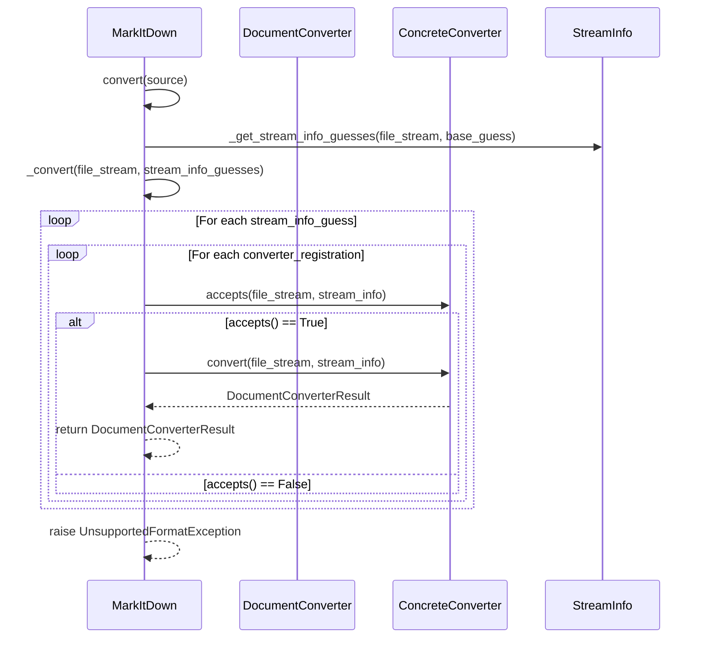
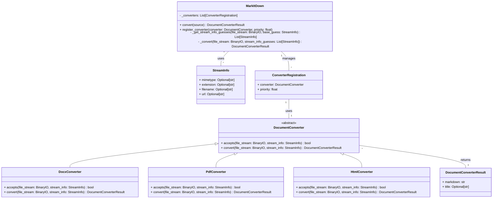

Based on the information gathered, here's an overview of the `markitdown` component:

**Component Description:**

The `markitdown` component is designed to convert various document types into Markdown format. It orchestrates the conversion process by identifying the file type, selecting an appropriate converter, and then converting the document content to Markdown. The component supports a wide range of file types, including DOCX, PDF, HTML, and others, and it's designed to be extensible through plugins.

**Main Classes and Their Purposes:**

*   **`MarkItDown`**: This is the main class that orchestrates the conversion process. It manages the registration of converters, handles different input types (local files, streams, URLs, and responses), and selects the appropriate converter based on file type detection.
*   **`DocumentConverter`**: This is an abstract base class for all document converters. It defines the `accepts()` and `convert()` methods, which are responsible for determining if a converter can handle a given file type and performing the conversion, respectively.
*   **`DocumentConverterResult`**: This class represents the result of a document conversion, containing the converted Markdown text and an optional title.
*   **`StreamInfo`**: This class holds metadata about the input stream, such as mimetype, extension, filename, and URL. It's used to help identify the file type and select the appropriate converter.
*   **Concrete Converters (e.g., `DocxConverter`, `PdfConverter`, `HtmlConverter`)**: These classes are concrete implementations of the `DocumentConverter` abstract class, each responsible for converting a specific file type to Markdown.

**Main Flow (Sequence Diagram):**

**Component Structure (Class Diagram):**

