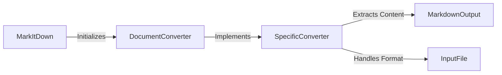

## Format Converters Component Overview

This component is responsible for converting various file formats into Markdown. It contains a collection of specialized converters, each handling a specific file format.

### Data Flow Diagram

### Component Descriptions

*   **MarkItDown**: The main class that orchestrates the conversion process. It initializes and enables the necessary converters. It interacts with `DocumentConverter` to start the conversion process.
    *   Relevant source files:
        *   `repos.markitdown.packages.markitdown.src.markitdown._markitdown.MarkItDown`

*   **DocumentConverter**: An abstract base class for all specific converters. It defines the interface for converting documents to Markdown. Specific converters inherit from this class. It interacts with `MarkItDown` and `SpecificConverter`.
    *   Relevant source files:
        *   `repos.markitdown.packages.markitdown.src.markitdown._base_converter.DocumentConverter`
        *   `repos.markitdown.packages.markitdown.src.markitdown._base_converter.DocumentConverterResult`

*   **SpecificConverter**: Concrete implementations of `DocumentConverter` for specific file formats (e.g., DOCX, PDF, HTML). Each converter extracts content from its respective format and converts it into Markdown. It interacts with `DocumentConverter` and `MarkdownOutput`.
    *   Relevant source files:
        *   `repos.markitdown.packages.markitdown.src.markitdown.converters._pptx_converter.PptxConverter`
        *   `repos.markitdown.packages.markitdown.src.markitdown.converters._csv_converter.CsvConverter`
        *   `repos.markitdown.packages.markitdown.src.markitdown.converters._bing_serp_converter.BingSerpConverter`
        *   `repos.markitdown.packages.markitdown.src.markitdown.converters._xlsx_converter.XlsxConverter`
        *   `repos.markitdown.packages.markitdown.src.markitdown.converters._youtube_converter.YouTubeConverter`
        *   `repos.markitdown.packages.markitdown.src.markitdown.converters._doc_intel_converter.DocumentIntelligenceConverter`
        *   `repos.markitdown.packages.markitdown.src.markitdown.converters._wikipedia_converter.WikipediaConverter`
        *   `repos.markitdown.packages.markitdown.src.markitdown.converters._rss_converter.RssConverter`
        *   `repos.markitdown.packages.markitdown.src.markitdown.converters._epub_converter.EpubConverter`
        *   `repos.markitdown.packages.markitdown.src.markitdown.converters._plain_text_converter.PlainTextConverter`
        *   `repos.markitdown.packages.markitdown.src.markitdown.converters._zip_converter.ZipConverter`
        *   `repos.markitdown.packages.markitdown.src.markitdown.converters._image_converter.ImageConverter`
        *   `repos.markitdown.packages.markitdown.src.markitdown.converters._docx_converter.DocxConverter`
        *   `repos.markitdown.packages.markitdown.src.markitdown.converters._outlook_msg_converter.OutlookMsgConverter`
        *   `repos.markitdown.packages.markitdown.src.markitdown.converters._pdf_converter.PdfConverter`
        *   `repos.markitdown.packages.markitdown.src.markitdown.converters._audio_converter.AudioConverter`
        *   `repos.markitdown.packages.markitdown.src.markitdown.converters._ipynb_converter.IpynbConverter`

*   **InputFile**: Represents the input file in a specific format that needs to be converted. It is handled by `SpecificConverter`.

*   **MarkdownOutput**: The final Markdown output generated by the specific converter. It is the result of the conversion process. It is generated by `SpecificConverter`.
