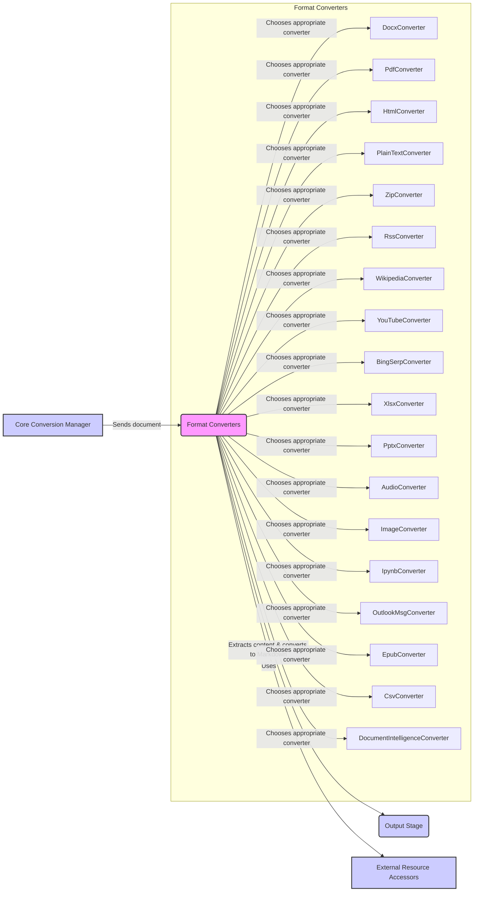

## Format Converters Component Overview

This component is responsible for converting various file formats into Markdown. It contains a collection of individual converters, each tailored to handle a specific file format. The core functionality involves receiving a file, extracting its content, converting it to Markdown, and passing the Markdown output to the next stage.

Here's a data flow diagram illustrating the process:

### Component Descriptions:

*   **Core Conversion Manager:** This component orchestrates the overall conversion process. It receives the input document and sends it to the appropriate converter within the Format Converters component.
    *   **Relevant source files:** N/A (This is a higher-level component)

*   **Format Converters:** This component acts as a container for various individual converters. It determines the file type and selects the appropriate converter to handle the conversion to Markdown. It may use External Resource Accessors if needed.
    *   **Relevant source files:** `repos.markitdown.packages.markitdown.src.markitdown.converters._docx_converter.DocxConverter`, `repos.markitdown.packages.markitdown.src.markitdown.converters._pdf_converter.PdfConverter`, `repos.markitdown.packages.markitdown.src.markitdown.converters._html_converter.HtmlConverter`, `repos.markitdown.packages.markitdown.src.markitdown.converters._plain_text_converter.PlainTextConverter`, `repos.markitdown.packages.markitdown.src.markitdown.converters._zip_converter.ZipConverter`, `repos.markitdown.packages.markitdown.src.markitdown.converters._rss_converter.RssConverter`, `repos.markitdown.packages.markitdown.src.markitdown.converters._wikipedia_converter.WikipediaConverter`, `repos.markitdown.packages.markitdown.src.markitdown.converters._youtube_converter.YouTubeConverter`, `repos.markitdown.packages.markitdown.src.markitdown.converters._bing_serp_converter.BingSerpConverter`, `repos.markitdown.packages.markitdown.src.markitdown.converters._xlsx_converter.XlsxConverter`, `repos.markitdown.packages.markitdown.src.markitdown.converters._pptx_converter.PptxConverter`, `repos.markitdown.packages.markitdown.src.markitdown.converters._audio_converter.AudioConverter`, `repos.markitdown.packages.markitdown.src.markitdown.converters._image_converter.ImageConverter`, `repos.markitdown.packages.markitdown.src.markitdown.converters._ipynb_converter.IpynbConverter`, `repos.markitdown.packages.markitdown.src.markitdown.converters._outlook_msg_converter.OutlookMsgConverter`, `repos.markitdown.packages.markitdown.src.markitdown.converters._epub_converter.EpubConverter`, `repos.markitdown.packages.markitdown.src.markitdown.converters._csv_converter.CsvConverter`, `repos.markitdown.packages.markitdown.src.markitdown.converters._doc_intel_converter.DocumentIntelligenceConverter`

*   **External Resource Accessors:** This component provides access to external resources, such as online services or APIs, that may be required by certain converters (e.g., fetching data from a website).
    *   **Relevant source files:** N/A (This is a general component, specific implementations would be in the individual converters).

*   **Output Stage:** This component receives the Markdown output from the Format Converters and handles the final output process (e.g., saving to a file, displaying in a UI).
    *   **Relevant source files:** N/A (This is a higher-level component)

*   **Individual Converters (DocxConverter, PdfConverter, HtmlConverter, etc.):** Each converter is responsible for handling a specific file format. They extract the content from the file and convert it to Markdown.
    *   **Relevant source files:** (See list under Format Converters component)
