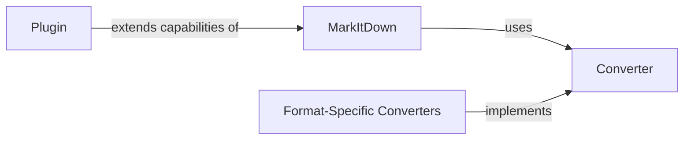

## Details

The MarkItDown project serves as a versatile document conversion system, enabling the transformation of various file types and web content into a unified Markdown representation. At its core, the MarkItDown orchestrator manages the conversion process by registering and invoking specialized Converter components. These converters, which include Format-Specific Converters for common document types like PPTX, DOCX, PDF, and HTML, are responsible for parsing their respective formats and generating a standardized internal representation. The system also supports extensibility through a Plugin mechanism, allowing developers to integrate custom conversion functionalities. The main flow involves the MarkItDown class receiving a source (file, URL, or stream), identifying its type, and then delegating the conversion to the appropriate registered Converter.

### MarkItDown
The main facade and orchestrator of the MarkItDown project, providing a simplified interface for document conversion and interaction with other components. It manages the registration and invocation of various converters.

**Related Classes/Methods**:

### Converter
An abstract interface or base class (DocumentConverter) for document converters, defining the common contract for converting various document formats into a unified internal representation. Concrete implementations of this interface handle specific file types.

**Related Classes/Methods**:

### Format-Specific Converters [[Expand]](./Format_Specific_Converters.md)
A collection of concrete converter implementations for standard document formats (e.g., PPTX, DOCX, PDF, HTML) that transform them into a unified internal representation (Markdown). These converters implement the Converter interface and are registered with the MarkItDown component.

**Related Classes/Methods**:

### Plugin
A component representing a plugin in the system, enabling the extension of MarkItDown's capabilities through custom integrations or functionalities. Plugins can register their own Converter implementations with the MarkItDown orchestrator.

**Related Classes/Methods**:

### [FAQ](https://github.com/CodeBoarding/GeneratedOnBoardings/tree/main?tab=readme-ov-file#faq)