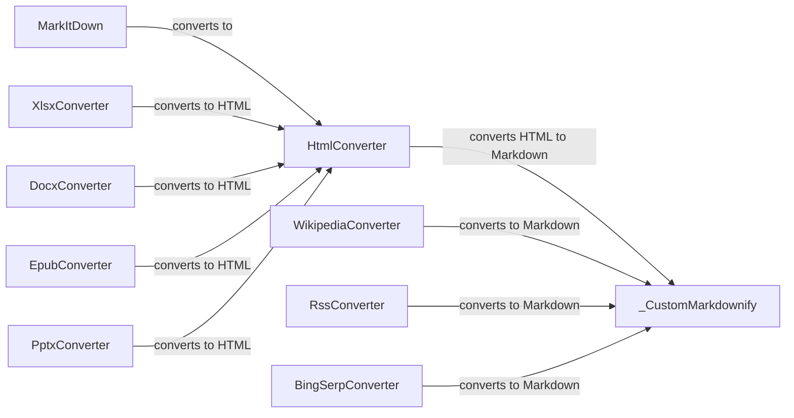

## Component Details

### MarkItDown
The main class responsible for converting various file formats to Markdown. It acts as the entry point for the conversion process, handling different input types such as local files, streams, and responses. It orchestrates the use of different converters based on the input file type.
- **Related Classes/Methods**: `repos.markitdown.packages.markitdown.src.markitdown._markitdown.MarkItDown`

### HtmlConverter
A converter that handles HTML to Markdown conversion. It's used as a base converter for other formats like XLSX, DOCX, and EPUB. It inherits from DocumentConverter and utilizes _CustomMarkdownify to perform the actual conversion.
- **Related Classes/Methods**: `repos.markitdown.packages.markitdown.src.markitdown.converters._html_converter.HtmlConverter`

### _CustomMarkdownify
A customized version of Markdownify, used to convert HTML to Markdown with specific rules and configurations. It's used by several converters and provides custom conversion rules for HTML elements like headings and images. It allows fine-grained control over the Markdown output.
- **Related Classes/Methods**: `repos.markitdown.packages.markitdown.src.markitdown.converters._markdownify._CustomMarkdownify`

### XlsxConverter
Converter for XLSX files. It converts XLSX content to HTML using HtmlConverter and then to Markdown. It inherits from DocumentConverter and handles the specifics of extracting and converting data from XLSX files.
- **Related Classes/Methods**: `repos.markitdown.packages.markitdown.src.markitdown.converters._xlsx_converter.XlsxConverter`

### DocxConverter
Converter for DOCX files. It converts DOCX content to HTML using HtmlConverter and then to Markdown. It inherits from HtmlConverter and is responsible for extracting content from DOCX files and passing it to the HTML converter.
- **Related Classes/Methods**: `repos.markitdown.packages.markitdown.src.markitdown.converters._docx_converter.DocxConverter`

### EpubConverter
Converter for EPUB files. It converts EPUB content to HTML using HtmlConverter and then to Markdown. It inherits from HtmlConverter and handles the specifics of extracting content from EPUB files.
- **Related Classes/Methods**: `repos.markitdown.packages.markitdown.src.markitdown.converters._epub_converter.EpubConverter`

### PptxConverter
Converter for PPTX files. It converts PPTX content to HTML using HtmlConverter and then to Markdown. It inherits from DocumentConverter and is responsible for extracting content from PPTX files.
- **Related Classes/Methods**: `repos.markitdown.packages.markitdown.src.markitdown.converters._pptx_converter.PptxConverter`

### WikipediaConverter
Converter for Wikipedia content. It extracts content from Wikipedia pages and converts it to Markdown using _CustomMarkdownify. It inherits from DocumentConverter and is responsible for fetching and parsing Wikipedia content.
- **Related Classes/Methods**: `repos.markitdown.packages.markitdown.src.markitdown.converters._wikipedia_converter.WikipediaConverter`

### RssConverter
Converter for RSS feeds. It parses RSS feed content and converts it to Markdown using _CustomMarkdownify. It inherits from DocumentConverter and handles the retrieval and parsing of RSS feeds.
- **Related Classes/Methods**: `repos.markitdown.packages.markitdown.src.markitdown.converters._rss_converter.RssConverter`

### BingSerpConverter
Converter for Bing Search Engine Results Page (SERP) content. It extracts content from Bing SERP and converts it to Markdown using _CustomMarkdownify. It inherits from DocumentConverter and is responsible for fetching and parsing Bing SERP results.
- **Related Classes/Methods**: `repos.markitdown.packages.markitdown.src.markitdown.converters._bing_serp_converter.BingSerpConverter`
