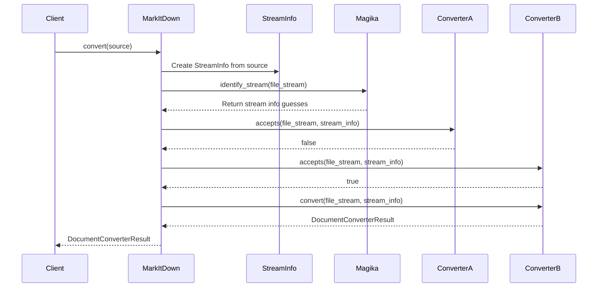
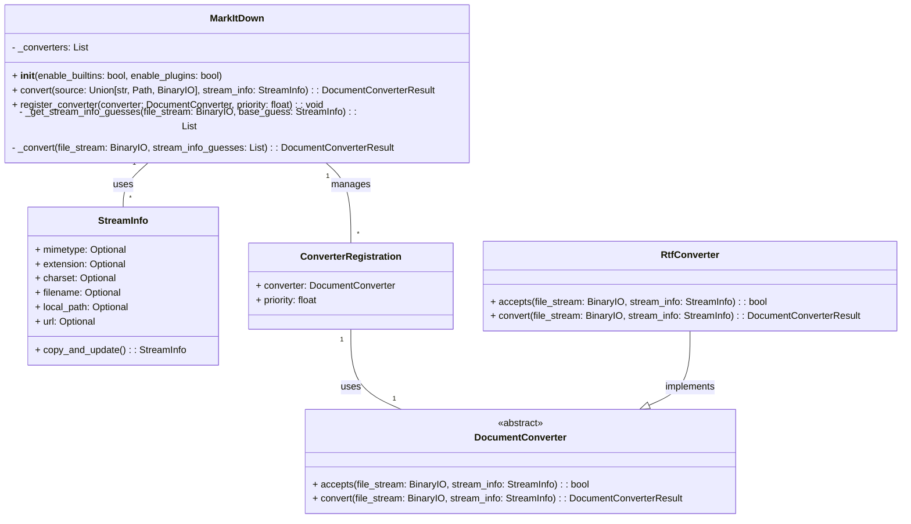

```text
## MarkItDown Component Overview

The `MarkItDown` component is a document conversion orchestrator that converts various file types and web pages into Markdown format. It uses a chain of responsibility pattern with `DocumentConverter` implementations to handle different file types. The component identifies the file type using `StreamInfo` and `magika` and then selects the appropriate converter.

**Main Classes and Their Purposes:**

*   **`MarkItDown`**: The central orchestrator class. It manages the registration of converters, identifies the input stream type, and delegates the conversion process to the appropriate converter.
*   **`DocumentConverter`**: An abstract base class that defines the interface for all document converters. Subclasses implement the `accepts` and `convert` methods to handle specific file types.
*   **`StreamInfo`**: A data class that holds metadata about the input stream, such as MIME type, file extension, charset, filename, local path, and URL. This information is used to determine the appropriate converter to use.
*   **`ConverterRegistration`**: A data class that associates a `DocumentConverter` with a priority.
*   **`RtfConverter`**: A concrete `DocumentConverter` implementation that converts RTF files to Markdown. (Example from plugin)

**Main Flow:**

The main flow involves the `MarkItDown` orchestrator receiving a document, determining its type, and delegating the conversion to a suitable `DocumentConverter`.



**Component Structure:**

The component's structure revolves around the `MarkItDown` class managing a collection of `DocumentConverter` instances. The `StreamInfo` class provides metadata to help select the appropriate converter.

