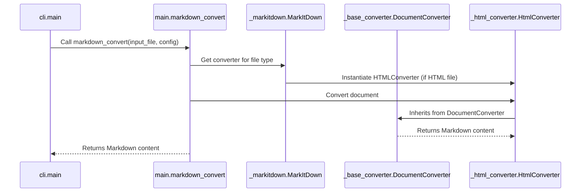
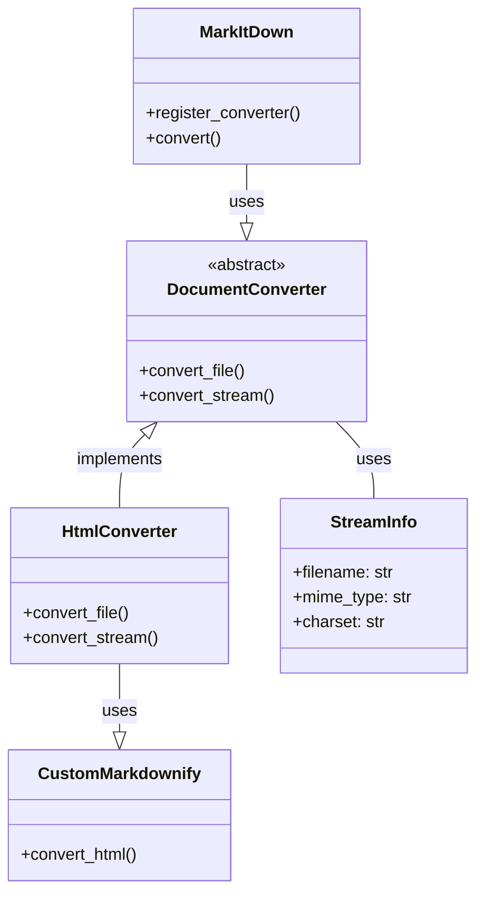

Okay, I will analyze the provided information and generate a component overview, sequence diagram, and class diagram.

**1. Component Description:**

The `markitdown` component is a versatile document conversion tool that transforms various file formats into Markdown. It features a core orchestration module that manages the conversion process, document converters for specific file types, stream management for handling input and output, and HTML-to-Markdown conversion utilities. The component is designed to be extensible through plugins, allowing for the addition of new file format converters.

**2. Core Classes and Their Purposes:**

*   **`markitdown.main.markdown_convert`**: The main function that orchestrates the conversion process. It takes input files, determines the appropriate converter, and outputs the Markdown content.
*   **`markitdown.cli.main`**: The command-line interface entry point. It parses command-line arguments, calls `markdown_convert`, and handles user interaction.
*   **`markitdown.config.load_config`**: Loads configuration settings that control the conversion process.
*   **`markitdown._markitdown.MarkItDown`**: A class that manages converter registration and provides the main interface for conversion.
*   **`markitdown._base_converter.DocumentConverter`**: An abstract base class for all document converters. It defines the interface for converting a document to Markdown.
*   **`markitdown._stream_info.StreamInfo`**: A data class that encapsulates information about the input stream, such as filename, MIME type, and charset.
*   **`markitdown.converters._html_converter.HtmlConverter`**: A concrete `DocumentConverter` implementation for converting HTML files to Markdown.
*   **`markitdown.converters._markdownify._CustomMarkdownify`**: Extends the `markdownify` library to provide custom HTML-to-Markdown conversion rules.

**3. Main Flow (Sequence Diagram):**

The main flow involves the following classes: `cli.main`, `main.markdown_convert`, `_markitdown.MarkItDown`, `_base_converter.DocumentConverter`, and a specific converter (e.g., `_html_converter.HtmlConverter`).

**4. Component Structure (Class Diagram):**

