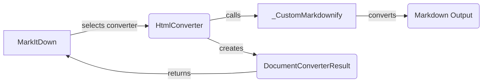

## HTML-to-Markdown Conversion Flow

This diagram illustrates the flow of converting HTML content to Markdown using the `markitdown` library, focusing on the `HTML-to-Markdown Converter` component.

### Component Descriptions:

*   **MarkItDown**: The main entry point for the conversion process. It receives the input document and determines the appropriate converter to use based on the file type. It then orchestrates the conversion by calling the selected converter and returning the result.

    *   **Source Files**: `markitdown._markitdown.MarkItDown`

*   **HtmlConverter**: Responsible for converting HTML content to Markdown. It receives HTML input, preprocesses it, and then utilizes `_CustomMarkdownify` to perform the core conversion. It also handles any necessary post-processing of the output.

    *   **Source Files**: `markitdown.converters._html_converter.HtmlConverter`

*   **_CustomMarkdownify**: A customized implementation of the `Markdownify` library, tailored to handle specific HTML elements and formatting requirements. It extends the base `Markdownify` functionality to provide more control over the conversion process.

    *   **Source Files**: `markitdown.converters._markdownify._CustomMarkdownify`

*   **Markdown Output**: The final Markdown content generated by the conversion process. This is the output returned by `_CustomMarkdownify` and potentially post-processed by `HtmlConverter`.

*   **DocumentConverterResult**: Represents the result of the document conversion, containing the converted markdown and associated metadata. It encapsulates the output of the conversion process, providing a structured way to access the converted markdown content and any relevant metadata.

    *   **Source Files**: `markitdown._base_converter.DocumentConverterResult`