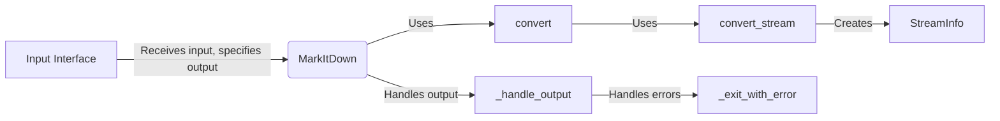

```mermaid
graph LR
    A[Input Interface] -- Receives input, specifies output --> B(MarkItDown) 
    B -- Uses --> C[convert] 
    C -- Uses --> D[convert_stream]
    D -- Creates --> E[StreamInfo]
    B -- Handles output --> F[_handle_output]
    F -- Handles errors --> G[_exit_with_error]


```