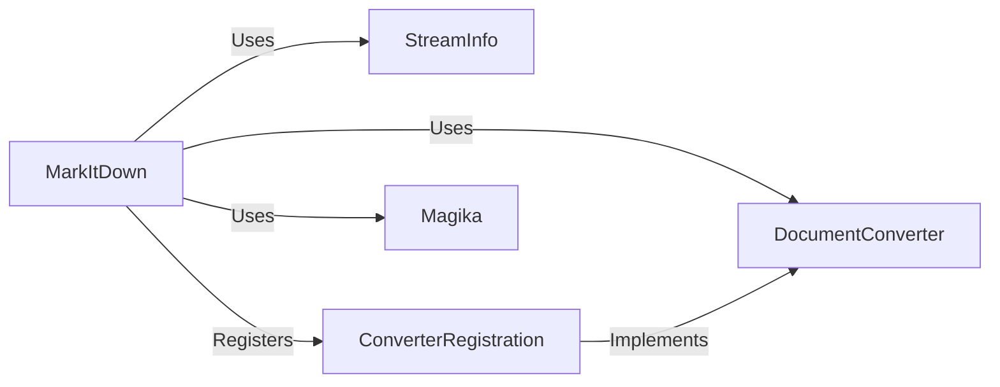

## Component Details

### StreamInfo
The StreamInfo component is a data class responsible for encapsulating metadata about the input stream being processed. This includes information such as the MIME type, file extension, URL (if applicable), and local file path (if available). It serves as a central repository for stream-related information, providing context to other components like converters, enabling them to make informed decisions about how to handle the input data.
- **Related Classes/Methods**: `markitdown._stream_info.StreamInfo`

### MarkItDown
The MarkItDown component is the core orchestrator of the document conversion process. It receives an input stream, utilizes StreamInfo to gather metadata about the stream, and then selects the appropriate DocumentConverter based on the stream's characteristics and registered converter priorities. It manages the overall conversion workflow, ensuring that the input is correctly processed and transformed into markdown format. It also uses Magika to enhance stream info guesses.
- **Related Classes/Methods**: `markitdown._markitdown.MarkItDown`

### DocumentConverter
The DocumentConverter component is an abstract base class that defines the interface for all concrete document converters. It specifies the methods that converters must implement to accept and convert documents. This abstraction allows MarkItDown to work with different types of converters in a uniform way, promoting extensibility and maintainability.
- **Related Classes/Methods**: `markitdown._base_converter.DocumentConverter`

### ConverterRegistration
The ConverterRegistration component is a data class that associates a DocumentConverter with a priority. This priority determines the order in which converters are attempted during the conversion process. It allows the MarkItDown component to select the most appropriate converter for a given input stream based on a predefined ranking.
- **Related Classes/Methods**: `markitdown._markitdown.MarkItDown`

### Magika
The Magika component is responsible for identifying the file type of an input stream using the Magika library. It enhances the stream info guesses. This information is then used by the MarkItDown component to select the appropriate DocumentConverter.
- **Related Classes/Methods**: `markitdown._markitdown.MarkItDown`
