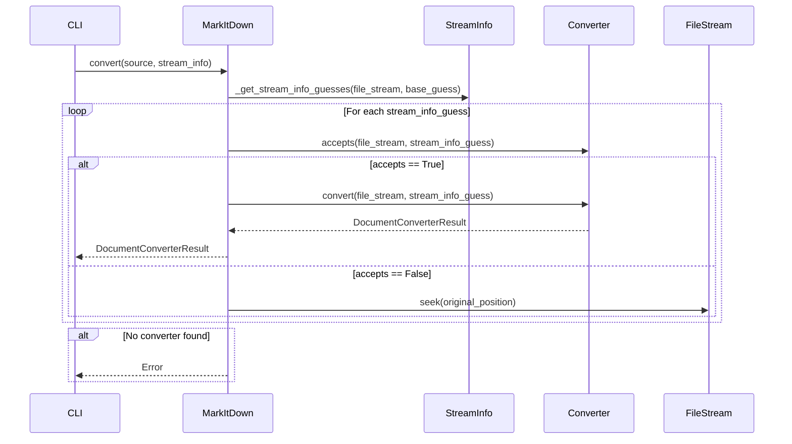
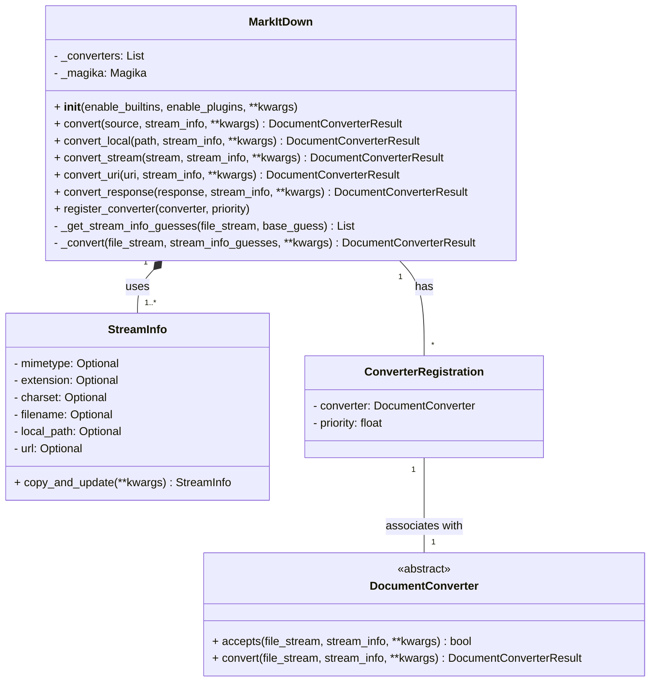

### Component Overview: Markitdown Document Conversion

The `Markitdown` component is responsible for converting documents of various formats into Markdown. It orchestrates the process of identifying the document type, selecting an appropriate converter, and performing the conversion. The component supports built-in converters and plugins for extending its capabilities.

**Main Classes and Their Purposes:**

*   **`MarkItDown`**: The central class that manages the conversion process. It handles converter registration, stream information guessing, and the overall conversion workflow.
*   **`DocumentConverter`**: An abstract base class for all document converters. It defines the `accepts` and `convert` methods that concrete converters must implement.
*   **`StreamInfo`**: A data class that encapsulates information about the input stream, such as MIME type, file extension, and charset. This information is used to determine the appropriate converter to use.
*   **`ConverterRegistration`**: A data class that associates a `DocumentConverter` with a priority.
*   **`main`**: The entry point of the `markitdown` application. It parses command-line arguments, initializes the `MarkItDown` class, and performs the conversion based on the provided input.

**Main Flow:**

**Class Diagram:**

