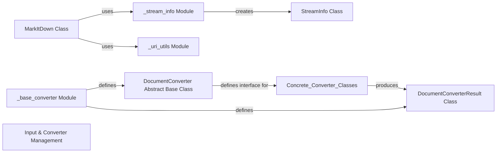

## Component Details

The `Input & Converter Management` component is fundamental to MarkItDown's operation, serving as the initial gateway for all incoming data and the foundational layer for extending conversion capabilities. It ensures that diverse input streams are properly identified and prepared, and that new conversion methods can be seamlessly integrated. This component is responsible for the initial handling and interpretation of diverse input data streams, including the extraction of crucial metadata (MIME type, file extension, and character set) and intelligent guessing of stream properties. It also establishes the foundational framework for defining and managing document converters, including abstract interfaces for converters and their results, ensuring a standardized approach to extending MarkItDown's conversion capabilities. The `MarkItDown` core engine leverages these functionalities to prepare inputs and select appropriate conversion strategies.

### StreamInfo Class
A dataclass that encapsulates all relevant metadata about an input stream or document, such as `mimetype`, `extension`, `charset`, `filename`, `local_path`, and `url`. It acts as a standardized data carrier throughout the conversion pipeline.

**Related Classes/Methods**:

- `StreamInfo` (0:0)

### _stream_info Module
This module contains functions responsible for intelligently guessing properties of an input stream, such as its MIME type and character set, when this information is not explicitly provided. It uses various heuristics (e.g., magic bytes, file extensions) to enrich the `StreamInfo` object.

**Related Classes/Methods**:

- <a href="https://github.com/microsoft/markitdown/blob/master/packages/markitdown/src/markitdown/_stream_info.py#L0-L0" target="_blank" rel="noopener noreferrer">`packages.markitdown.src.markitdown._stream_info` (0:0)</a>

### _uri_utils Module
Provides utility functions for handling Uniform Resource Identifiers (URIs), including converting file URIs to local paths and parsing data URIs. This is crucial for MarkItDown to process inputs from various sources (local files, URLs, data URIs).

**Related Classes/Methods**:

- <a href="https://github.com/microsoft/markitdown/blob/master/packages/markitdown/src/markitdown/_uri_utils.py#L0-L0" target="_blank" rel="noopener noreferrer">`packages.markitdown.src.markitdown._uri_utils` (0:0)</a>

### DocumentConverter Abstract Base Class
Defines the abstract interface for all document converters within MarkItDown. It specifies the `convert` method that all concrete converters must implement, ensuring a consistent API for the `MarkItDown` core engine to interact with them.

**Related Classes/Methods**:

- `DocumentConverter` (0:0)

### DocumentConverterResult Class
A dataclass that defines the standardized output format for all converters. It encapsulates the converted content (e.g., Markdown string) and its associated metadata, ensuring consistency in the output of the conversion process.

**Related Classes/Methods**:

- `DocumentConverterResult` (0:0)

### _base_converter Module
This module provides the foundational framework for defining and managing document converters, including the abstract interfaces (`DocumentConverter`, `DocumentConverterResult`) and potentially base functionalities or helper methods common to all converters.

**Related Classes/Methods**:

- <a href="https://github.com/microsoft/markitdown/blob/master/packages/markitdown/src/markitdown/_base_converter.py#L0-L0" target="_blank" rel="noopener noreferrer">`packages.markitdown.src.markitdown._base_converter` (0:0)</a>

### MarkItDown Class
While primarily the core engine, the `MarkItDown` class within the `_markitdown.py` module is responsible for initiating the input processing (using `_stream_info` and `_uri_utils`) and registering available converters. It acts as the orchestrator that brings together the input handling and converter framework.

**Related Classes/Methods**:

- `MarkItDown` (0:0)

### Input & Converter Management
This component is responsible for the initial handling and interpretation of diverse input data streams, including the extraction of crucial metadata (MIME type, file extension, and character set) and intelligent guessing of stream properties. It also establishes the foundational framework for defining and managing document converters, including abstract interfaces for converters and their results, ensuring a standardized approach to extending MarkItDown's conversion capabilities. The `MarkItDown` core engine leverages these functionalities to prepare inputs and select appropriate conversion strategies.

**Related Classes/Methods**: _None_

### [FAQ](https://github.com/CodeBoarding/GeneratedOnBoardings/tree/main?tab=readme-ov-file#faq)