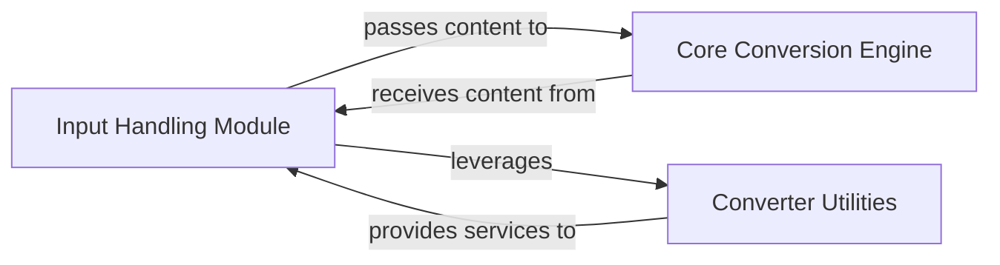

## Details

The `markitdown` project is designed to convert various document and stream types into Markdown format. The core functionality revolves around the `Markitdown` class, which acts as a central orchestrator for handling diverse input sources and applying appropriate conversion logic. It leverages a system of registered converters to process different file formats and URI schemes, ensuring a flexible and extensible architecture. The process typically involves an initial input handling phase where raw content is acquired and normalized, followed by a core conversion phase that transforms the content into Markdown, often assisted by specialized utility functions for parsing specific data formats or URI types.

### Input Handling Module [[Expand]](./Input_Handling_Module.md)
This module is responsible for abstracting the acquisition of raw content from various input sources (local files, HTTP/S, file:, data: URIs, and binary streams). It performs the initial parsing and normalization of these inputs, preparing them for subsequent processing.

**Related Classes/Methods**:

- <a href="https://github.com/microsoft/markitdown/blob/main/packages/markitdown/src/markitdown/_markitdown.py" target="_blank" rel="noopener noreferrer">`markitdown.Markitdown.convert_local`</a>
- <a href="https://github.com/microsoft/markitdown/blob/main/packages/markitdown/src/markitdown/_markitdown.py" target="_blank" rel="noopener noreferrer">`markitdown.Markitdown.convert_uri`</a>
- <a href="https://github.com/microsoft/markitdown/blob/main/packages/markitdown/src/markitdown/_markitdown.py" target="_blank" rel="noopener noreferrer">`markitdown.Markitdown.convert_response`</a>
- <a href="https://github.com/microsoft/markitdown/blob/main/packages/markitdown/src/markitdown/_markitdown.py" target="_blank" rel="noopener noreferrer">`markitdown.Markitdown.convert_stream`</a>

### Core Conversion Engine
This component is responsible for the actual document transformation process. It receives pre-processed content from the Input Handling Module and applies the necessary conversion logic by iterating through registered converters.

**Related Classes/Methods**:

- <a href="https://github.com/microsoft/markitdown/blob/main/packages/markitdown/src/markitdown/_markitdown.py" target="_blank" rel="noopener noreferrer">`markitdown.Markitdown._convert`</a>

### Converter Utilities
A collection of specialized utility modules that assist the Input Handling Module in parsing and normalizing different input types, particularly various URI schemes.

**Related Classes/Methods**:

### [FAQ](https://github.com/CodeBoarding/GeneratedOnBoardings/tree/main?tab=readme-ov-file#faq)