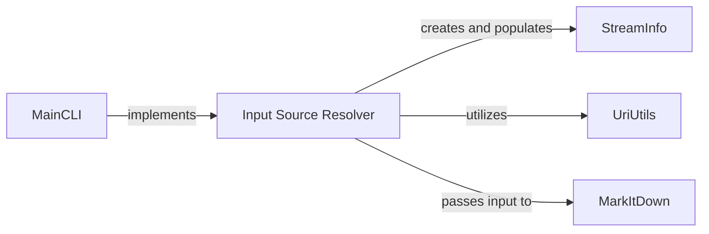

## Component Details

The Input Source Resolver is a fundamental logical component within the markitdown project because it serves as the initial gateway for all content processing. Its primary role is to abstract away the complexities of diverse input sources, presenting a standardized StreamInfo object to the downstream conversion logic. In essence, the Input Source Resolver ensures that the markitdown application can robustly and flexibly handle various input scenarios, making it adaptable and user-friendly by providing a clean, standardized input for the core conversion logic.

### Input Source Resolver
This component is responsible for identifying and preparing the input content source for conversion. It parses command-line arguments to determine if the input is a local file path, a URI, or standard input. It also processes any provided hints such as file extension, MIME type, or character set, and encapsulates this information into a StreamInfo object. This component ensures that the MarkItDown converter receives a unified and well-defined input stream.

**Related Classes/Methods**:

- <a href="https://github.com/microsoft/markitdown/blob/master/packages/markitdown/src/markitdown/__main__.py#L117-L198" target="_blank" rel="noopener noreferrer">`markitdown.__main__` (117:198)</a>
- <a href="https://github.com/microsoft/markitdown/blob/master/packages/markitdown/src/markitdown/_stream_info.py#L5-L31" target="_blank" rel="noopener noreferrer">`markitdown._stream_info.StreamInfo` (5:31)</a>
- <a href="https://github.com/microsoft/markitdown/blob/master/packages/markitdown/src/markitdown/_uri_utils.py#L0-L0" target="_blank" rel="noopener noreferrer">`markitdown._uri_utils` (0:0)</a>

### MainCLI
This module is the concrete implementation of the Input Source Resolver's logic. It's where command-line arguments are parsed, the actual input source (file, stdin, or URI) is identified, and the initial StreamInfo object is constructed based on user-provided hints. It is fundamental because it's the direct entry point for user interaction and the orchestrator of the initial input preparation phase.

**Related Classes/Methods**:

- <a href="https://github.com/microsoft/markitdown/blob/master/packages/markitdown/src/markitdown/__main__.py#L117-L198" target="_blank" rel="noopener noreferrer">`markitdown.__main__` (117:198)</a>

### StreamInfo
This class is fundamental as it provides a unified, consistent data structure to encapsulate all relevant metadata about the input stream (MIME type, extension, charset, filename, local path, URL). By creating and populating StreamInfo objects, the Input Source Resolver ensures that the subsequent conversion steps can operate on a well-defined and predictable input, regardless of its original source. Its immutability, facilitated by the copy_and_update method, promotes robust state management.

**Related Classes/Methods**:

- <a href="https://github.com/microsoft/markitdown/blob/master/packages/markitdown/src/markitdown/_stream_info.py#L5-L31" target="_blank" rel="noopener noreferrer">`markitdown._stream_info.StreamInfo` (5:31)</a>

### UriUtils
This utility module is crucial for the Input Source Resolver when dealing with URI-based inputs. It provides the necessary functions to convert file URIs to local paths and to parse data URIs. Without UriUtils, the markitdown application would be limited in its ability to handle web-based or embedded data inputs, significantly reducing its versatility and applicability in modern data processing workflows.

**Related Classes/Methods**:

- <a href="https://github.com/microsoft/markitdown/blob/master/packages/markitdown/src/markitdown/_uri_utils.py#L0-L0" target="_blank" rel="noopener noreferrer">`markitdown._uri_utils` (0:0)</a>

### MarkItDown
While not directly part of the *resolution* process, MarkItDown is the primary consumer of the Input Source Resolver's output. The entire purpose of resolving the input source and preparing the StreamInfo object is to feed it to the MarkItDown converter. This highlights the critical interaction and dependency, making MarkItDown fundamental to understanding the ultimate goal and flow of the Input Source Resolver.

**Related Classes/Methods**:

- <a href="https://github.com/microsoft/markitdown/blob/master/packages/markitdown/src/markitdown/_markitdown.py#L92-L770" target="_blank" rel="noopener noreferrer">`markitdown._markitdown.MarkItDown` (92:770)</a>

### [FAQ](https://github.com/CodeBoarding/GeneratedOnBoardings/tree/main?tab=readme-ov-file#faq)