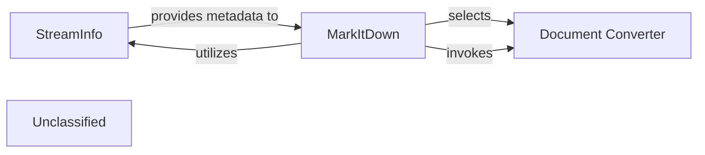

## Details

The MarkItDown subsystem is designed to convert various document types into a standardized Markdown format. At its core, the `MarkItDown` component orchestrates the conversion process. It leverages `StreamInfo` to analyze incoming data streams, determining crucial metadata such as file type and encoding. Based on this analysis, `MarkItDown` dynamically selects and invokes the appropriate `Document Converter` from a family of specialized converters. Each `Document Converter` is responsible for transforming a specific document format into Markdown, ensuring a flexible and extensible conversion pipeline.

### StreamInfo
This component is dedicated to analyzing incoming data streams to accurately determine file types, character encodings, and other crucial metadata. It acts as a utility module, providing essential pre-processing information.

**Related Classes/Methods**:

- <a href="https://github.com/microsoft/markitdown/blob/main/packages/markitdown/src/markitdown/_stream_info.py#L5-L32" target="_blank" rel="noopener noreferrer">`markitdown._stream_info.StreamInfo`:5-32</a>

### MarkItDown
The central orchestrator of the MarkItDown project. It utilizes the metadata provided by `StreamInfo` to select and invoke the appropriate `Document Converter` for processing the input stream. It embodies the core conversion pipeline.

**Related Classes/Methods**:

- <a href="https://github.com/microsoft/markitdown/blob/main/packages/markitdown/src/markitdown/_markitdown.py#L93-L776" target="_blank" rel="noopener noreferrer">`markitdown._markitdown.MarkItDown`:93-776</a>

### Document Converter
Represents the abstract interface for all document-specific converters. Concrete implementations of this component are responsible for converting a specific document type (e.g., PDF, DOCX, HTML) into a standardized Markdown format. These converters are selected dynamically by `MarkItDown` based on the stream analysis.

**Related Classes/Methods**:

- <a href="https://github.com/microsoft/markitdown/blob/main/packages/markitdown/src/markitdown/_base_converter.py#L42-L105" target="_blank" rel="noopener noreferrer">`markitdown._base_converter.DocumentConverter`:42-105</a>

### Unclassified
Component for all unclassified files and utility functions (Utility functions/External Libraries/Dependencies)

**Related Classes/Methods**: _None_

### [FAQ](https://github.com/CodeBoarding/GeneratedOnBoardings/tree/main?tab=readme-ov-file#faq)