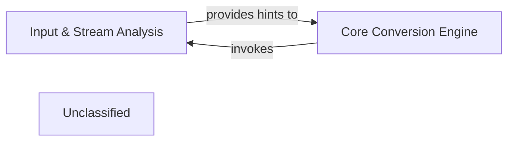

## Details

The `markitdown` system is designed around a core conversion process orchestrated by the `Core Conversion Engine`. This engine initiates the document processing by invoking the `Input & Stream Analysis` component. The `Input & Stream Analysis` is responsible for the initial classification of incoming document streams, extracting critical metadata and generating hints about the document's type and characteristics. These hints are then provided back to the `Core Conversion Engine`, which uses this information to intelligently select and manage the subsequent conversion steps, ensuring efficient and accurate processing of diverse document inputs.

### Input & Stream Analysis [[Expand]](./Input_Stream_Analysis.md)
This component is responsible for the initial analysis of incoming document streams, which can originate from local files, URIs, or direct input. Its primary function is to identify the document's type, extract essential initial metadata (such as file type, MIME type, and character encoding), and generate hints. These hints are crucial for the `Core Conversion Engine` to intelligently select the most appropriate `Document Converter` for the subsequent processing steps. It acts as the initial classification and routing mechanism for diverse inputs, and is invoked by the `Core Conversion Engine` to perform this initial assessment.

**Related Classes/Methods**:

- <a href="https://github.com/microsoft/markitdown/blob/main/packages/markitdown/src/markitdown/_stream_info.py" target="_blank" rel="noopener noreferrer">`markitdown._stream_info`</a>
- <a href="https://github.com/microsoft/markitdown/blob/main/packages/markitdown/src/markitdown/_markitdown.py" target="_blank" rel="noopener noreferrer">`markitdown._markitdown.MarkItDown._get_stream_info_guesses`</a>

### Core Conversion Engine
This component serves as the central orchestrator for the document conversion process. It initiates the document processing by invoking the `Input & Stream Analysis` component to gather initial insights. Based on the hints received, it intelligently selects and manages the appropriate `Document Converter` to perform the actual conversion. It manages the overall flow, ensuring that the correct conversion strategy is applied to diverse input streams and coordinating the various stages of the document transformation.

**Related Classes/Methods**:

- <a href="https://github.com/microsoft/markitdown/blob/main/packages/markitdown/src/markitdown/_markitdown.py" target="_blank" rel="noopener noreferrer">`markitdown._markitdown.MarkItDown`</a>

### Unclassified
Component for all unclassified files and utility functions (Utility functions/External Libraries/Dependencies)

**Related Classes/Methods**: _None_

### [FAQ](https://github.com/CodeBoarding/GeneratedOnBoardings/tree/main?tab=readme-ov-file#faq)