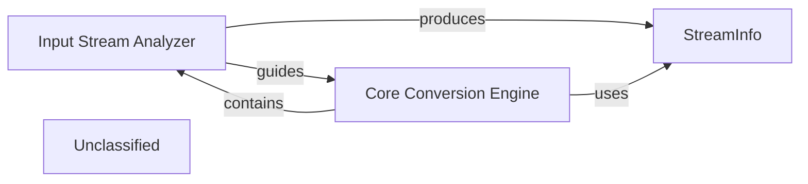

## Details

The `markitdown` subsystem is designed around a `Core Conversion Engine` that orchestrates the conversion of various document types into Markdown. This engine relies on an `Input Stream Analyzer` to first determine the characteristics of an incoming document stream, encapsulating this information in a `StreamInfo` object. The `Core Conversion Engine` then uses this `StreamInfo` to select and apply the appropriate `Document Converters` to perform the actual conversion. This modular design allows for flexible handling of diverse input formats and extensibility through additional converters.

### Input Stream Analyzer [[Expand]](./Input_Stream_Analyzer.md)
This component intelligently analyzes incoming document streams to determine their type, encoding, and other crucial metadata. It employs various techniques, including file extension analysis, MIME type detection, and content-based identification using tools like `magika` for file type and `charset_normalizer` for character set. Its output guides the `Core Conversion Engine` in selecting the most suitable converter.

**Related Classes/Methods**:

- <a href="https://github.com/microsoft/markitdown/blob/main/packages/markitdown/src/markitdown/_markitdown.py#L666-L765" target="_blank" rel="noopener noreferrer">`packages.markitdown.src.markitdown._markitdown._get_stream_info_guesses`:666-765</a>

### StreamInfo
A dataclass that encapsulates and provides a standardized, immutable structure for all relevant metadata about an input stream. This includes properties like mimetype, extension, charset, filename, local_path, and url. It also offers a `copy_and_update` method for creating new instances with modified information, ensuring data integrity.

**Related Classes/Methods**:

- <a href="https://github.com/microsoft/markitdown/blob/main/packages/markitdown/src/markitdown/_stream_info.py#L5-L32" target="_blank" rel="noopener noreferrer">`packages.markitdown.src.markitdown._stream_info.StreamInfo`:5-32</a>

### Core Conversion Engine
The central orchestrator of the entire document conversion pipeline. Within this subsystem's context, it receives `StreamInfo` objects produced by the `Input Stream Analyzer`. It integrates and relies on the `Input Stream Analyzer`'s logic to make informed decisions about which `Document Converters` to invoke and how to proceed with the conversion process.

**Related Classes/Methods**:

- <a href="https://github.com/microsoft/markitdown/blob/main/packages/markitdown/src/markitdown/_markitdown.py#L93-L776" target="_blank" rel="noopener noreferrer">`packages.markitdown.src.markitdown._markitdown.MarkItDown`:93-776</a>

### Unclassified
Component for all unclassified files and utility functions (Utility functions/External Libraries/Dependencies)

**Related Classes/Methods**: _None_

### [FAQ](https://github.com/CodeBoarding/GeneratedOnBoardings/tree/main?tab=readme-ov-file#faq)