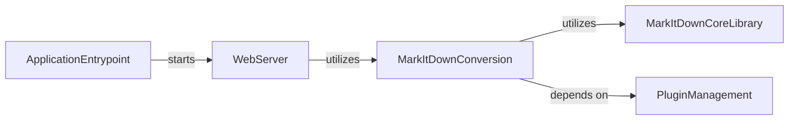

## Component Details

The MCP Application serves as an alternative entry point for the `markitdown` library, exposing its URI conversion capabilities as an asynchronous HTTP/SSE service. The main flow involves parsing command-line arguments to determine whether to run as an HTTP/SSE server or a standard MCP server. If running as an HTTP/SSE server, it sets up a Starlette application with routes for Server-Sent Events and Streamable HTTP, utilizing the `FastMCP` server for core functionalities. It also manages plugin enablement for `markitdown` conversions.

### MarkItDownConversion
This component is responsible for converting URIs (http, https, file, data) into markdown format. It leverages the MarkItDown library and checks for plugin enablement.

**Related Classes/Methods**:

- <a href="https://github.com/microsoft/markitdown/blob/master/packages/markitdown-mcp/src/markitdown_mcp/__main__.py#L21-L23" target="_blank" rel="noopener noreferrer">`packages.markitdown-mcp.src.markitdown_mcp.__main__:convert_to_markdown` (21:23)</a>

### PluginManagement
This component handles the logic for determining if MarkItDown plugins should be enabled based on environment variables.

**Related Classes/Methods**:

- <a href="https://github.com/microsoft/markitdown/blob/master/packages/markitdown-mcp/src/markitdown_mcp/__main__.py#L26-L31" target="_blank" rel="noopener noreferrer">`packages.markitdown-mcp.src.markitdown_mcp.__main__:check_plugins_enabled` (26:31)</a>

### WebServer
This component sets up and manages the Starlette web application, including routes for Server-Sent Events (SSE) and Streamable HTTP. It integrates with the FastMCP server.

**Related Classes/Methods**:

- <a href="https://github.com/microsoft/markitdown/blob/master/packages/markitdown-mcp/src/markitdown_mcp/__main__.py#L34-L78" target="_blank" rel="noopener noreferrer">`packages.markitdown-mcp.src.markitdown_mcp.__main__:create_starlette_app` (34:78)</a>
- `packages.markitdown-mcp.src.markitdown_mcp.__main__:handle_sse` (full file reference)
- `packages.markitdown-mcp.src.markitdown_mcp.__main__:handle_streamable_http` (full file reference)
- `packages.markitdown-mcp.src.markitdown_mcp.__main__:lifespan` (full file reference)

### ApplicationEntrypoint
This is the main entry point of the MarkItDown MCP server. It parses command-line arguments and orchestrates the startup of either the web server (HTTP/SSE) or the standard MCP server.

**Related Classes/Methods**:

- <a href="https://github.com/microsoft/markitdown/blob/master/packages/markitdown-mcp/src/markitdown_mcp/__main__.py#L82-L123" target="_blank" rel="noopener noreferrer">`packages.markitdown-mcp.src.markitdown_mcp.__main__:main` (82:123)</a>

### MarkItDownCoreLibrary
This component represents the core MarkItDown library responsible for the actual URI conversion to markdown.

**Related Classes/Methods**:

- <a href="https://github.com/microsoft/markitdown/blob/master/packages/markitdown/src/markitdown/_markitdown.py#L396-L455" target="_blank" rel="noopener noreferrer">`markitdown._markitdown.MarkItDown.convert_uri` (396:455)</a>
- <a href="https://github.com/microsoft/markitdown/blob/master/packages/markitdown/src/markitdown/_markitdown.py#L93-L771" target="_blank" rel="noopener noreferrer">`markitdown._markitdown.MarkItDown` (93:771)</a>

### [FAQ](https://github.com/CodeBoarding/GeneratedOnBoardings/tree/main?tab=readme-ov-file#faq)