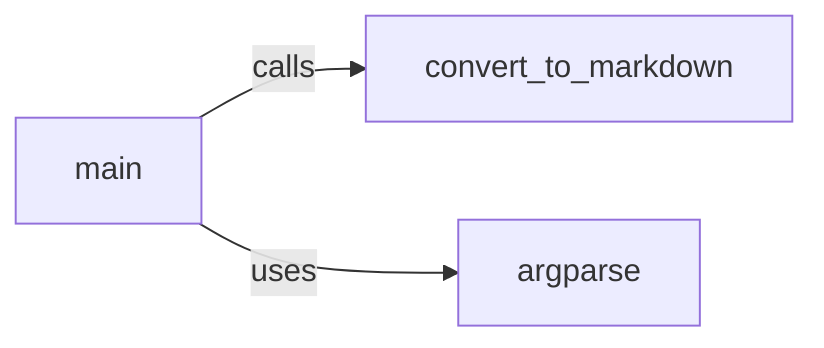

## Component Details

The markitdown-mcp component converts content from a specific format (likely 'mcp') to Markdown. It uses command-line arguments to specify input and output files, reads the input, performs the conversion, and writes the Markdown output. The core functionality is orchestrated by the `convert_to_markdown` function, which is invoked by the `main` function after parsing arguments using `argparse`.

### main
The main function serves as the entry point for the markitdown-mcp application. It handles command-line argument parsing using `argparse` and calls the `convert_to_markdown` function to initiate the conversion process.
- **Related Classes/Methods**: `markitdown.packages.markitdown-mcp.src.markitdown_mcp.__main__:main` (73:114)

### convert_to_markdown
This function orchestrates the conversion of input content to Markdown. It reads the input from a specified file or standard input, invokes the core conversion logic (potentially involving other modules or functions), and writes the resulting Markdown to a file or standard output.
- **Related Classes/Methods**: `markitdown.packages.markitdown-mcp.src.markitdown_mcp.__main__:convert_to_markdown` (20:22)

### argparse
The `argparse` module is used for parsing command-line arguments, providing a user-friendly interface for specifying input and output files, as well as other conversion options.
- **Related Classes/Methods**: `argparse` (full file reference)