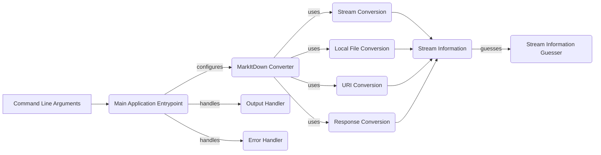

## Main Application Entrypoint Overview

The `Main Application Entrypoint` component serves as the entry point for the `markitdown` application. It's responsible for parsing command-line arguments, initiating the conversion process using the `MarkItDown` converter, handling potential errors, and managing the output of the converted markdown content.

Here's a data flow diagram illustrating the component's role within the application:

**Component Descriptions:**

*   **Command Line Arguments:** Represents the input provided by the user when running the `markitdown` application. These arguments specify the input source (file, URI, etc.), output destination, and other conversion options.

*   **Main Application Entrypoint (`markitdown.__main__.main`):** Parses command-line arguments, configures the `MarkItDown` converter, initiates the conversion process based on the input source, and handles output and errors. **Relevant source file:** `markitdown/__main__.py`

*   **MarkItDown Converter (`markitdown._markitdown.MarkItDown`):** The core component responsible for orchestrating the conversion process. It receives the input source and options from the `Main Application Entrypoint`, determines the appropriate converter to use, and manages the conversion workflow. **Relevant source file:** `markitdown/_markitdown.py`

*   **Stream Conversion (`markitdown._markitdown.MarkItDown.convert_stream`):** Handles the conversion of content provided as a stream. It reads the stream, determines the encoding, and calls the appropriate converter. **Relevant source file:** `markitdown/_markitdown.py`

*   **Local File Conversion (`markitdown._markitdown.MarkItDown.convert_local`):** Handles the conversion of content from a local file. It opens the file, reads its content as a stream, and then uses stream conversion. **Relevant source file:** `markitdown/_markitdown.py`

*   **URI Conversion (`markitdown._markitdown.MarkItDown.convert_uri`):** Handles the conversion of content from a URI (URL or file path). It fetches the content from the URI and then uses stream conversion. **Relevant source file:** `markitdown/_markitdown.py`

*   **Response Conversion (`markitdown._markitdown.MarkItDown.convert_response`):** Handles the conversion of content from a `requests.Response` object. It reads the response content as a stream and then uses stream conversion. **Relevant source file:** `markitdown/_markitdown.py`

*   **Stream Information (`markitdown._stream_info.StreamInfo`):** A data class that encapsulates information about the input stream, such as mimetype, extension, charset, filename, local path, and URL. It helps in determining the appropriate converter to use. **Relevant source file:** `markitdown/_stream_info.py`

*   **Stream Information Guesser (`markitdown._markitdown.MarkItDown._get_stream_info_guesses`):** Guesses the stream information (mimetype, extension, charset) based on the stream content using the `magika` library. **Relevant source file:** `markitdown/_markitdown.py`

*   **Output Handler (`markitdown.__main__._handle_output`):** Handles the output of the converted markdown, writing it to the specified output stream or file. It receives the converted content from the `MarkItDown` converter and writes it to the desired destination. **Relevant source file:** `markitdown/__main__.py`

*   **Error Handler (`markitdown.__main__._exit_with_error`):** Handles errors that occur during the conversion process. It exits the program with an error message and a non-zero exit code. **Relevant source file:** `markitdown/__main__.py`