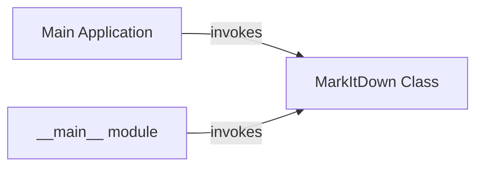

## Component Details

The MarkItDown application converts markdown text into various output formats. The application's entry point is the `__main__` module, which parses command-line arguments and initializes the `MarkItDown` class. The `MarkItDown` class then orchestrates the conversion process, loading plugins and built-in features, and finally converting the input markdown to the desired output format. The conversion can happen from a local file, a URL, or a stream.

### Main Application
This component serves as the entry point for the MarkItDown application. It handles command-line arguments, initializes the Core Conversion Manager (MarkItDown class), and starts the conversion process based on user input. It's responsible for setting up the application environment and kicking off the main workflow.
- **Related Classes/Methods**: `markitdown.packages.markitdown.src.markitdown.__main__:main` (13:200)

### MarkItDown Class
The central class responsible for converting markdown text into other formats. It handles initialization, enabling built-in features and plugins, registering custom converters, and performing the actual conversion process. It acts as the orchestrator for the entire markdown conversion process.
- **Related Classes/Methods**: `markitdown.packages.markitdown.src.markitdown._markitdown.MarkItDown:__init__` (97:130), `markitdown.packages.markitdown.src.markitdown._markitdown.MarkItDown:enable_builtins` (132:221), `markitdown.packages.markitdown.src.markitdown._markitdown.MarkItDown:enable_plugins` (223:241), `markitdown.packages.markitdown.src.markitdown._markitdown.MarkItDown:convert` (243:291), `markitdown.packages.markitdown.src.markitdown._markitdown.MarkItDown:convert_local` (293:328), `markitdown.packages.markitdown.src.markitdown._markitdown.MarkItDown:convert_stream` (330:375), `markitdown.packages.markitdown.src.markitdown._markitdown.MarkItDown:convert_url` (377:394), `markitdown.packages.markitdown.src.markitdown._markitdown.MarkItDown:convert_uri` (396:455), `markitdown.packages.markitdown.src.markitdown._markitdown.MarkItDown:convert_response` (457:527), `markitdown.packages.markitdown.src.markitdown._markitdown.MarkItDown:_convert` (529:619), `markitdown.packages.markitdown.src.markitdown._markitdown.MarkItDown:register_page_converter` (621:627), `markitdown.packages.markitdown.src.markitdown._markitdown.MarkItDown:register_converter` (629:659), `markitdown.packages.markitdown.src.markitdown._markitdown.MarkItDown:_get_stream_info_guesses` (661:760)

### __main__ module
The entry point of the `markitdown` application. It handles command-line argument parsing and invokes the `MarkItDown` class to perform the conversion based on the provided input and options.
- **Related Classes/Methods**: `markitdown.packages.markitdown.src.markitdown.__main__:main` (13:200)