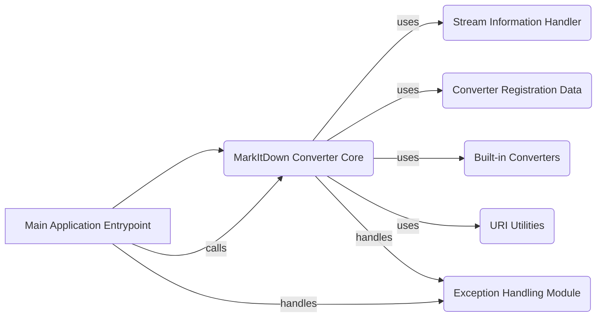

**Component: Main Application Entrypoint**
*Description*: Parses command-line arguments, initializes the MarkItDown converter, and handles the overall conversion process, including error handling and output. It calls the MarkItDown Converter Core to perform the conversion and handles any exceptions that may occur.
*Relevant source files*:
*   `repos.markitdown.packages.markitdown.src.markitdown.__main__`

**Component: MarkItDown Converter Core**
*Description*: Manages the conversion workflow, including converter registration, plugin loading, stream information handling, and invoking the appropriate converter based on input type. It uses Stream Information Handler to determine the input type, Converter Registration Data to find the appropriate converter, URI Utilities for URI handling, and Built-in Converters to perform the actual conversion. It also handles exceptions using the Exception Handling Module.
*Relevant source files*:
*   `repos.markitdown.packages.markitdown.src.markitdown._markitdown`

**Component: Stream Information Handler**
*Description*: Represents and manages information about the input stream, such as MIME type, charset, and extension, aiding in converter selection. It is used by the MarkItDown Converter Core to determine the appropriate converter to use.
*Relevant source files*:
*   `repos.markitdown.packages.markitdown.src.markitdown._stream_info`

**Component: Converter Registration Data**
*Description*: Stores information about a registered converter, including input/output MIME types and the conversion function. It is used by the MarkItDown Converter Core to find the appropriate converter to use.
*Relevant source files*:
*   `repos.markitdown.packages.markitdown.src.markitdown._markitdown`

**Component: URI Utilities**
*Description*: Provides utility functions for handling URIs, including file URI to path conversion and data URI parsing. It is used by the MarkItDown Converter Core to handle URIs.
*Relevant source files*:
*   `repos.markitdown.packages.markitdown.src.markitdown._uri_utils`

**Component: Exception Handling Module**
*Description*: Defines custom exceptions for various conversion failure scenarios. It is used by the Main Application Entrypoint and MarkItDown Converter Core to handle exceptions.
*Relevant source files*:
*   `repos.markitdown.packages.markitdown.src.markitdown._exceptions`

**Component: Built-in Converters**
*Description*: A collection of classes, each responsible for converting a specific file format to markdown. It is used by the MarkItDown Converter Core to perform the actual conversion.
*Relevant source files*:
*   `repos.markitdown.packages.markitdown.src.markitdown.converters`
