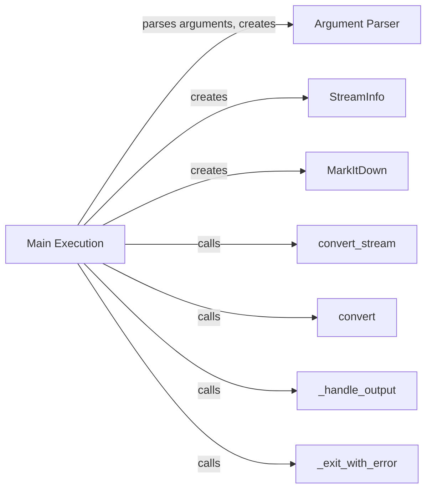

## Component Details

### Main Execution
Handles argument parsing, main program execution, and output handling.
- **Related Classes/Methods**: `repos.markitdown.packages.markitdown.src.markitdown.__main__:main`, `repos.markitdown.packages.markitdown.src.markitdown.__main__._exit_with_error`, `repos.markitdown.packages.markitdown.src.markitdown.__main__._handle_output`

### Argument Parser
Parses command-line arguments using `argparse` to configure the conversion process.
- **Related Classes/Methods**: `argparse.ArgumentParser`

### StreamInfo
Collects information about the input stream, such as extension, MIME type, and charset.
- **Related Classes/Methods**: `repos.markitdown.packages.markitdown.src.markitdown._stream_info.StreamInfo`

### MarkItDown
The core class responsible for converting markdown to other formats. It handles different types of conversions based on the input.
- **Related Classes/Methods**: `repos.markitdown.packages.markitdown.src.markitdown._markitdown.MarkItDown`

### _handle_output
Handles the output of the converted markdown, writing to a file or stdout.
- **Related Classes/Methods**: `repos.markitdown.packages.markitdown.src.markitdown.__main__._handle_output`

### _exit_with_error
Exits the program with an error message.
- **Related Classes/Methods**: `repos.markitdown.packages.markitdown.src.markitdown.__main__._exit_with_error`

### convert_stream
Converts a stream of data to markdown.
- **Related Classes/Methods**: `repos.markitdown.packages.markitdown.src.markitdown._markitdown.MarkItDown.convert_stream`

### convert
Converts a file to markdown based on the filename provided.
- **Related Classes/Methods**: `repos.markitdown.packages.markitdown.src.markitdown._markitdown.MarkItDown.convert`
